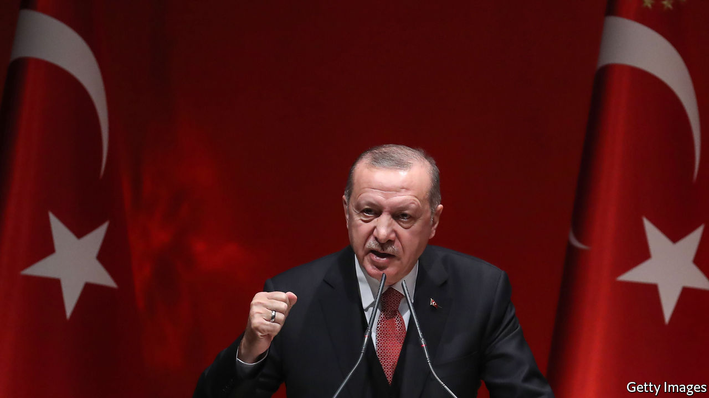

###### Erdogan thinks big

# Turkey’s strongman, Recep Tayyip Erdogan, takes to the world stage 

##### He is posing as the voice of Muslims everywhere and of the global south 

 

> Sep 8th 2020 

PRESIDENT RECEP TAYYIP ERDOGAN likes to cut to the chase. Others may think the multilateral dispute over territorial waters, continental shelves and hydrocarbons in the eastern Mediterranean, which has brought Turkey close to war with Greece, is complicated. For Turkey’s leader, however, it is simply an “example of modern colonialism” by European countries, as he put it in a speech on September 1st. “The era of those who for centuries have left no region unexploited from Africa to South America, no community unmassacred and no human being unoppressed, is coming to an end,” he added.

Mr Erdogan has long fulminated against the West to stir up patriotic support at home. Now, he is increasingly addressing a global audience, too. Having failed to reshape the Middle East in the wake of the Arab spring, Mr Erdogan is looking elsewhere for greatness. He is trying to reinvent himself as the voice of the umma (ie, Muslims everywhere) and also of the world’s poor.


His efforts so far have focused mostly on Europe. Turkey has traditionally seen itself as a protector of ethnic Turks in countries like France, Belgium and Germany. More recently, Mr Erdogan has started to think bigger. “Turkey is trying to position itself as the main patron of all Muslims,” says Sinem Adar, a researcher at the German Institute for International and Security Affairs. The policy has already worked in the Balkans, where Turkey has competed against Gulf money for the sympathy of Bosniaks, Albanians and Kosovars, but is relatively new elsewhere.

A big part of the new outreach is Turkey’s worldwide campaign against Islamophobia, for which Mr Erdogan’s government has mobilised foreign missions, aid agencies, lobby groups and friendly academics. Turkish consulates have been asked to encourage Muslims to report to them any instances of prejudice or abuse. (Turkey pays rather less attention to abuses in China, where perhaps a million Muslim Uighurs have been locked up in camps and many have been sterilised.)

Prejudice against Muslims is a serious problem in Europe. But critics suspect Mr Erdogan’s campaign is also intended to provoke resentment of Western governments and legitimise his own foreign-policy aims. Others fear the implications for free speech. “Islamophobia”, says Samim Akgonul, an academic at Strasbourg University, “is being used by Turkey as a shield to ban and avoid all critical discourse on Islam in the academic world and the media.”

Turkey is also courting Muslims and black people in America. The campaign has featured the usual—Mr Erdogan has opened an Islamic centre near Washington—and the unexpected. A foundation on the board of which one of his daughters is a director recently bought the Chicago estate of Muhammad Ali, a champion boxer, for $3m and plans to turn the site into a summer school for Muslims. A couple of years ago Mr Erdogan met the daughters of Malcolm X, a Black Muslim and hence another hero; one daughter reportedly said the Turkish strongman embodied her late father’s legacy. Shortly afterwards, Turkey renamed a street near the new American embassy in Ankara “Malcolm X Avenue”.

Not everything has gone according to plan. Mr Erdogan had to cut short his trip to Ali’s funeral in 2016 after learning he would not be allowed to speak or lay a piece of the cloth covering the Kaaba on the boxer’s coffin. And when he condemned the killing of George Floyd, calling his death in a tweet “one of the most painful manifestations of the unjust order”, a black socialist group told him (in words not suitable for print) to mind his own business. Analysts helpfully suggest his message might resonate better if his government stopped arresting thousands of people on flimsy terrorism charges and disenfranchising millions of Kurds by locking up their elected leaders.

None of this has dimmed Mr Erdogan’s global ambitions. Turkey’s president appears genuinely to view himself not only as the voice of all Muslims but of the whole global south. His re-election in 2018, he said, was a victory for “all the aggrieved people in our region, all the oppressed in the world”. He can certainly take credit for increasing humanitarian-aid spending, investing vast sums in impoverished Somalia, opposing India’s siege of Kashmir and hosting nearly 4m refugees from neighbouring Syria. But his anti-imperialist crusade has also taken him to strange places. Mr Erdogan has backed Nicolás Maduro’s repressive regime in Venezuela, a relationship lubricated by hundreds of millions of dollars in gold trade, and former president Omar al-Bashir’s genocidal one in Sudan. Last month he congratulated Alexander Lukashenko, the Belarusian dictator, on his “victory” in rigged presidential elections.

The charm offensive has had some success. Mr Erdogan enjoys popular support in corners of Africa and Asia. Some 75% of Palestinians and roughly the same share of Jordanians approve of his policies, according to a poll published last year. His popularity in Pakistan is such that the country’s prime minister, Imran Khan, joked earlier this year that Mr Erdogan could safely win in his country’s coming elections. Anecdotal evidence, says Mr Akgonul, suggests he may also be the most popular Muslim politician among young Arabs in Europe.

Turkey’s leader and his acolytes seem to be convinced that the old world order is crumbling, and are looking for a role in the new one. His embrace of the global periphery is riven with contradictions and hypocrisy, making it more hype than substance. But it is here to stay. ■

 Ms Adar’s quote has been corrected from “Turkey is trying to position itself as the main patron of all Muslims in Europe” to “Turkey is trying to position itself as the main patron of all Muslims”.

