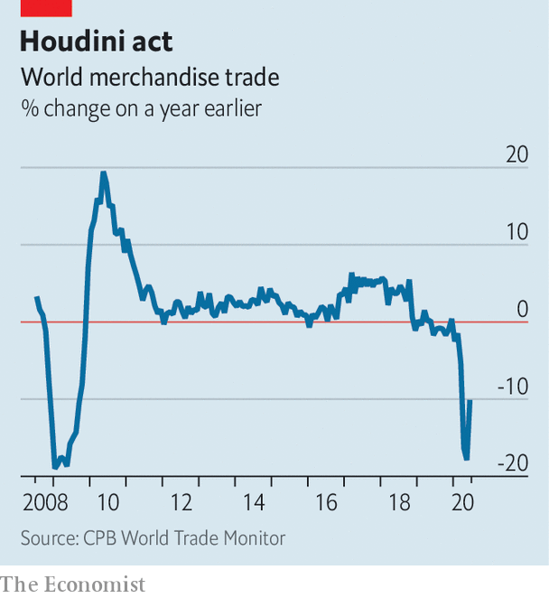

###### Down but not out

# How has trade survived covid-19? 

##### Better than during the global financial crisis 

 

> Sep 12th 2020 

IN QUENTIN TARANTINO’S “Kill Bill: Volume 2”, an action drama, the protagonist, played by Uma Thurman, punches her way out of a coffin. Global trade in goods has performed a similar death-defying stunt during the covid-19 pandemic. In April things looked dismal. Some predicted global trade would slump by more than 30% this year, compared with 2019. But after a gut-wrenching spring, trade volumes recorded their biggest monthly rise on record in June, the last month of available data (see chart). Oxford Economics, a consultancy, predicts that in 2020 as a whole volumes may drop by 10%.

This resilience has defied recent experience, as well as expectations. In 2009, when global GDP fell by 0.1% in the final year of the financial crisis, trade plunged by a whopping 13%. This year the IMF forecasts that global GDP could fall by 4.9%, ie, 50 times more than in 2009. So why will the hit to trade probably be smaller?


After the financial crisis trade volumes fell much further than GDP mostly because people stopped buying heavily traded durable goods, such as cars. But in the current crisis, untraded domestic services have been harder hit than they were back then. Going to the cinema or a restaurant halted during lockdown. Buying an imported fridge did not. That has made the drop in trade relative to GDP smaller.

 


Moreover, the robustness of the world’s production apparatus has underpinned trade flows. Covid-19 froze supply chains, but in Asia at least they swiftly started to thaw. According to Simon Evenett of the University of St Gallen in Switzerland, the number of trade restrictions applied on medical goods and medicine since the start of the crisis peaked in April, and has since fallen by 15%. Even more importantly, lockdowns were lifted more quickly than expected, allowing exporting powerhouses like China and Germany to reopen factories and boost output.

Pandemic-induced demand gave trade in some products extra pep. America’s imports of protective equipment tripled between March and July, calculates Panjiva, a trade-data company. Covid-related products including computing equipment for home-working has accounted for the majority of China’s year-on-year export growth in each month since June. Eytan Buchman of Freightos, an online marketplace, reports that ocean-freight prices are surging for routes between America and South-East Asia, partly because of “near-frantic” e-commerce offerings by small businesses.

Policymakers have played a pivotal role in the trade revival. Monetary and fiscal firepower was bigger and faster than trade experts had expected. Central-bank liquidity measures kept trade finance flowing better than it did during the financial crisis, says Jennifer McKeown of Capital Economics, a research outfit.

Although the trade performance is cause for relief, no one should declare victory yet. A second wave of lockdowns, or overhasty efforts to curtail economic stimulus, could derail the recovery. The value of exports from South Korea dipped in August relative to July, as did those of China after adjusting for an artificially depressed base in 2019. Robert Koopman, chief economist of the World Trade Organisation, which oversees global trade, doubts there will be a sustained V-shaped recovery.

Overlaying this is a concern about the lingering unevenness of trade. Brad Setser of the Council on Foreign Relations, an American think-tank, says that the trade slump has shrunk the gap between most countries’ imports and exports, reducing imbalances. Yet there have been two standout exceptions. The first is China, whose rapid reopening has sent its exports of goods surging to a level last seen before the Sino-American trade war—almost $60bn higher than imports in August. The second is America, whose policies to stoke demand have had the side-effect of causing its trade deficit to increase further—to around $80bn in July.

This imbalance is ominous. Although the so-called Phase One trade deal between America and China was meant to prop up American exports to China, so far it has disappointed. Meanwhile, President Donald Trump is haranguing China ahead of elections in November. Trade may not have performed as badly as many feared. But it still has an alarming ability to pack a Thurmanesque punch. ■

Editor’s note: Some of our covid-19 coverage is free for readers of The Economist Today, our daily . For more stories and our pandemic tracker, see our 

