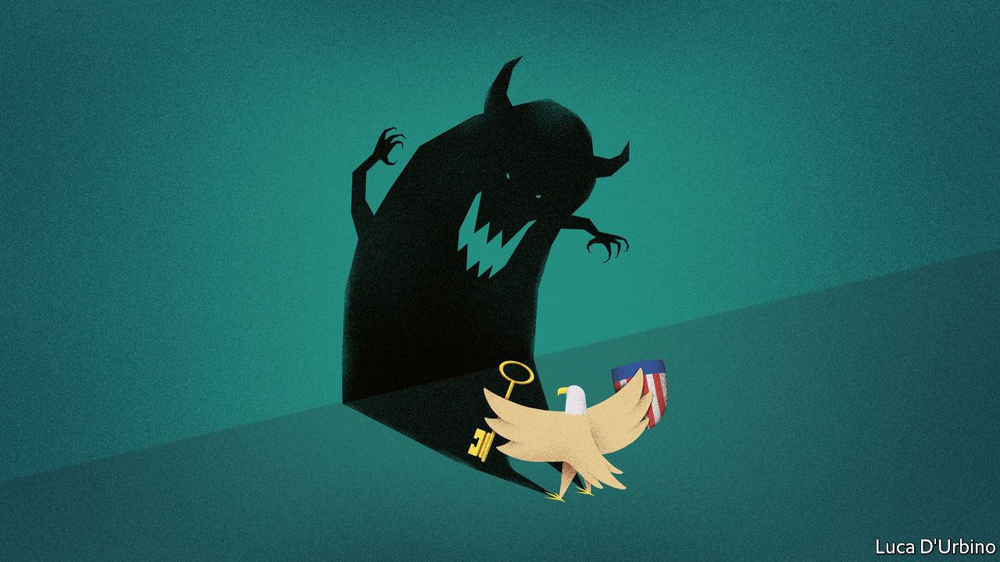
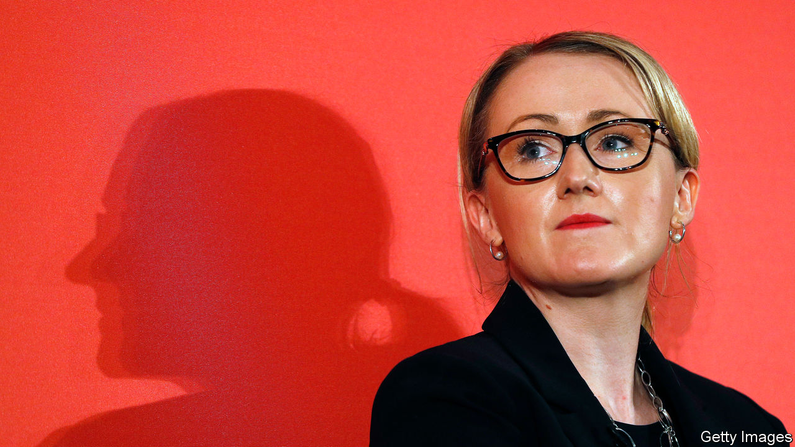

###### On digital trade, Ferdinand Magellan, the centre-left, mental health, diplomacy, economics

# Letters to the editor 

##### A selection of correspondence 

> Sep 12th 2020 


 


Digital protection

You went through the arguments about the multilateral rules that are needed to deal with America’s justification of national security when it acts unilaterally as tensions arise within the digital economy (“”, August 22nd). Such rules exist in Article 21 of the General Agreement on Tariffs and Trade (GATT). The article allows any contracting party to take “any action it considers necessary for the protection of its essential security interests”. Resorting to this rarely used provision, however, presents a conundrum for the World Trade Organisation when dealing with disputes.


Either the WTO dispute-settlement body rules that it cannot second guess a member’s security interests, prompting a flood of similar petitions of Article 21, or it finds against the party invoking Article 21, which, could well prompt America’s departure from the WTO. Hence the problem underlying all of this. The multilateral trading system can no longer rely on America, its most powerful member, to uphold its principles. America must temper its exercise of national sovereignty through its self-harming unilateral action and respect international norms.

It remains to be seen whether this will change after November’s presidential election, with a return, perhaps, to earlier, more open, American policies that encouraged America to run faster in the global tech race. Probably not.

KEN HEYDONFormer deputy director for trade at the OECDArbois, France

 


Magellan didn’t quite make it

Ferdinand Magellan was not “the first known circumnavigator” (, August 29th). He commanded the flotilla of five ships and 239 sailors that sailed in 1519 from Spain but he died in combat in the Philippines in 1521 before completing the round-the-world voyage. Juan Sebastián Elcano was then elected leader for the rest of it, reaching Spain in the only remaining ship, Victoria, in 1522. He and the 18 emaciated survivors who dragged themselves ashore were indeed the first true circumnavigators.

MARQUéS DE TAMARóNMadrid

 


Lessons for the centre-left

Anyone in Labour who wants a fairer, more balanced progressive Britain would be advised to steer well clear of Saul Alinsky’s “Rules for Radicals” (“”, August 22nd). The book was published in 1971 and encouraged the Democrats in America to embrace the presidential candidacy of the unelectable George McGovern. The next 40 years saw the triumph of Ronald Reagan, the Wall Street-besotted Bill Clinton and ever-rising inequality.

The American left is irrelevant. If the British left wants inspiration there are plenty of examples from social democratic parties in Germany or the Nordic countries. Not as flashy as American radicalism but closer to what can be done in Britain’s constipated, class-ridden, centralised, obsequious, Treasury-run monarchy.

DENIS MACSHANESenior adviserAvisa PartnersBrussels

 


wrote about the “asymmetric polarisation” thesis, which says that the Republican Party has moved well to the right while the Democratic Party has remained more or less on the centre-left (August 22nd). The problem with this theory, which was developed in the early 2010s, is that it focuses narrowly on certain public-policy issues and largely ignores the raging culture war, where the Democrats have indeed drifted to the left. It takes no account of the fundamental asymmetry that defines modern politics.

For better or worse, progressivism tends to progress, and reactionaries tend to react. This is the rule the world over, and in this, as in many other things, America is not really an exception.

JOHN SEXTONChicago

 


Keep calm

I applaud the attention you gave to the mental-health effects of covid-19 in “” (August 29th). However, to suggest that there “were no large-scale psychological studies during the first or second world wars” is to neglect J.T. McCurdy’s brilliant “The Structure of Morale”, published in 1943. The book was a psychological examination of British resilience during the Blitz and draws a conclusion from which we can draw strength today: “When fear that has been conditioned with some danger is extinguished, it does not leave a vacuum. There remains a less dramatic feeling, one of courage, confidence, or merely security.”

DAVID PEDUTOWestminster, Colorado

You spoke positively about the French system of “psychological emergency units” that offer mental-health support immediately after a terrorist attack. Although these interventions are well-intentioned, I must point out that there is no good evidence that they reduce the incidence of post-traumatic stress disorder. On the contrary, there are many studies to suggest that early psychological interventions after trauma might even worsen symptoms, through a process of retraumatisation.

DR LOUIS DE BOISANGERRoyal Edinburgh Psychiatric Hospital

 


Leadership starts at the top

Thank you for your excellent if depressing article on the status of American diplomacy and the State Department, even though it came perilously close to being an obituary (“”, August 15th). However, no amount of money, manpower, or far-better management will produce an increased role for professional diplomacy in American foreign policy. That objective is determined by Congress and the White House.

The State Department, like all departments, is an agent, not a principal. There is an old Foreign Service legend that when questioned by an irritated President John Kennedy as to what was wrong with “that department of yours”, Ambassador Chip Bohlen replied “You are, Mr President, you are.”

AMBASSADOR (RET) EDWARD MARKSForeign Service of the United StatesWashington, DC

According to a recent study former volunteers and staff in the Peace Corps constitute an extraordinary percentage of Foreign Service recruits, rising to assistant secretary and ambassadorial levels. Because of covid-19, some 8,000 volunteers and staff were returned to the United States; if Donald Trump is re-elected it is unlikely that the Peace Corps will be recreated.

WILLIAM JOSEPHSONFounding counselPeace Corps, 1961-66New York

 


Cost-benefit analysis

In regards to pursuing a career as an academic economist (“”, August 8th) let’s be honest, up to seven destitute years studying for a PhD really isn’t that bad. Although don’t forget the pre-doc to hone your skills and the pre-pre-doc so that you come prepared. Nor would it be wise to neglect a post-doc in case you miss out on the opportunity for networking.

As I said, is ten years studying for a PhD in economics really that bad?

ELLIOT FOOTEMelbourne

