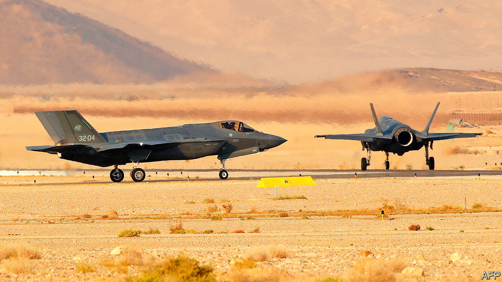

###### Stealth gap

# How an overpriced warplane complicates diplomacy in the Middle East 

##### America wants to sell F-35s to the United Arab Emirates. Israel objects 

 

> Sep 12th 2020 

DON’T BE FOOLED by the nondescript buildings of the Nevatim air base, deep in the Negev desert. Lately the facility in southern Israel has served as something like an advanced testing ground for the most state-of-the-art warplanes made in the West. Take the American-made F-35 stealth fighter jet, which Israeli pilots flew over Lebanon, Syria and the Gaza Strip in 2018—the plane’s first combat missions. Israel receives such weapons long before America’s other allies in the region, giving it a unique military advantage. But it may be losing some of that edge.

When Israel and the United Arab Emirates (UAE) agreed to establish diplomatic relations on August 13th, it seemed like a straightforward deal. The countries had been moving closer for some time. Israel quietly works with the Gulf states to counter Iran. The UAE’s decision to become just the third Arab country to recognise Israel, despite its occupation of Palestinian lands, reflected these warmer ties. There was more to it than that, however. It has since emerged that the UAE is in talks with America over an arms deal that will include weapons such as the F-35, which America has hitherto only sold to close allies.


This has not gone down well in Israel. Its prime minister, Binyamin Netanyahu, reportedly went along with the proposed arms deal in private as a way of smoothing the talks over diplomatic relations. He denied this when the deal became public last month, criticising it. But the complaints stopped after a meeting with Mike Pompeo, America’s secretary of state, in Jerusalem. “Netanyahu may have said that he’s against selling F-35s in principle,” says Amos Gilad, a retired major-general in Israel’s army. “But he certainly gave America the impression that Israel wouldn’t try and block it.”

America has long ensured that Israel has a “qualitative military edge” (QME) over its neighbours. The concept, which has been codified into law, means that Israel is consulted on big arms deals in the region. America’s Arab allies, though able to buy its warplanes and missiles, are usually blocked from purchasing its most advanced weapons. “There are teams of Israeli experts who deal with the QME constantly in a dialogue with the Pentagon,” says an Israeli diplomat. “But Netanyahu has gone ahead without consulting them.”

Those experts are now voicing their concerns. The F-35’s unique shape and radar-absorbent materials allow it to evade detection. It is not just a warplane, but a sophisticated intelligence hub capable of swapping intelligence on faraway targets with nearby planes and ships. Other advanced weapons said to be included in the UAE deal—such as Reaper drones and the EA-18G Growler, an electronic-warfare plane—also raise questions about whether they could be used against Israel in a conflict. Some worry that the technology might eventually end up in the hands of Israel’s enemies. “We can’t predict what will happen in ten years, whether radical Islamists take over a country like the Muslim Brotherhood did in 2012. Or a country becomes allied with Iran,” says Mr Gilad.

The UAE has been building up its air force, which has seen action in Iraq, Libya, Syria and Yemen. It has long wanted the F-35, despite its price tag of around $80m per plane. “Under Barack Obama they couldn’t even get a classified briefing on the F-35’s capabilities, let alone the planes,” says Dan Shapiro, a former US ambassador to Israel. But President Donald Trump has made arms sales a central part of his foreign policy. “They have the money and they would like to order quite a few F-35s,” he said of the UAE. “We’ll see what happens.” Last month the Emiratis reportedly cancelled a meeting with Israel and America because they were cross about Mr Netanyahu’s public opposition to the deal.

In normal times the sale would take many months to process. The State Department must certify that it does not undermine Israel’s QME. It might also place restrictions on how the F-35 is used. The Defence Department must ensure that the UAE is capable of securely owning and operating all of the weapons in the deal. (A former American defence official says the sale of F-35s probably would not affect Israel’s QME, in part because the UAE would struggle to exploit the plane’s most advanced capabilities without other technology.) The deal must also be approved by Congress, which has criticised the UAE’s role in the war in Yemen and its support for a warlord who is challenging the UN-backed government in Libya. Still, many politicians will probably say yes if Israel does not make too much of a fuss.

Mr Trump could try to placate Israel by providing it with other advanced weapons. He might also invoke his emergency powers to sidestep Congress and push the deal forward before November, when he is facing re-election. The president did as much last year, declaring an “emergency” over Iranian activity in order to expedite an $8bn arms deal with Saudi Arabia, Jordan and the UAE over objections from Congress. Still, it could take up to a decade to deliver the F-35—plenty of time for a different administration to reconsider the contract. Turkey was kicked out of the F-35 programme over its purchase of a Russian air-defence system.

“It’s not just about the UAE,” says an Israeli diplomat who works on defence issues. “Netanyahu has created a precedent and now other Arab countries will demand F-35s as well.” A precedent was set four decades ago, when Egypt made peace with Israel. Since then America has sold Egypt everything from fighter jets to frigates—but nothing as advanced as the F-35. Some in Israel’s defence establishment think such weapons are a price worth paying for the normalisation of relations with the Arab world. Others question whether such a volatile region really needs more arms. ■

