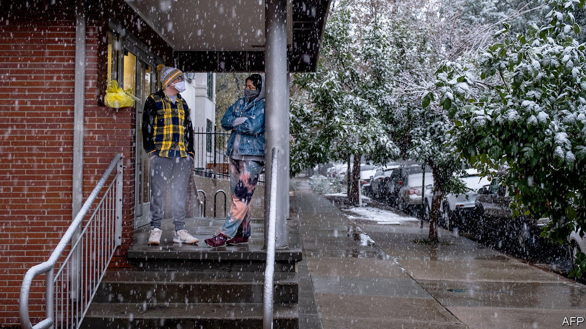

###### Weather and climate change

# How weird weather can span the world 

##### Climate change is making the jet stream wilder 

 

> Sep 12th 2020 

ON SEPTEMBER 7TH in Denver, Colorado, the temperature reached 34°C (93°F), 6°C above what is normal for the time of year. The city was sitting under the dome of hot air encouraging record fires across the American West (see ). The next day snow started to fall. By midnight the temperature was below freezing. What happened?

The immediate cause was the polar jet stream, a world-girdling high-altitude wind driven by temperature differences between Arctic air to the north and warmer air to the south. Its meandering path is set by patterns of high and low pressure known as Rossby waves. And because fluid dynamics are never simple, the jet stream exerts its own influence in turn upon these guiding waves.


As the jet stream passed to the north of the high pressure over America’s west coast, the big temperature difference between that hot air and what lay farther to the north added to its energy. This extra impetus meant that as the jet came down the east side of the high-pressure zone it curved back on itself towards the west. In meteorological terms, the Rossby wave broke. In this case the breaking wave’s white water took the form of large quantities of cold air from the Canadian north that were suddenly pulled south, and which crashed down on Colorado.

This is not in itself evidence of climate change. But that may lurk in the background. Go back to the first days of September and Typhoon Maysak was passing north over the Koreas, the second of an unprecedented troika of typhoons to do so this summer, thanks to hot seas and cyclone-friendly conditions to the south (see ). The heat Maysak gave up over eastern China drove the jet stream there to particularly impressive speeds. That intensification travelled on over the Pacific, possibly predisposing the system towards what happened five days later in Denver, says Philippe Papin of America’s National Weather Service.

Not all typhoons that pass over Korea will have such effects. (Maysak’s successor, Haishen, did not.) They need to hit the jet stream in the right way. But greenhouse warming is making the tropics larger. Models suggest this will mean that more tropical storms reach high latitudes, where they can invigorate the meanders of the jet stream in rather the same way that a child sends a wave down a skipping rope with a flick of the wrist.

Some scientists are concerned that, as climate change worsens, the ability of Rossby waves to drive sudden changes in the weather will increase. Even today, they can bring about whiplash weather when the circumstances are right.

For more coverage of climate change, register for The Climate Issue, our fortnightly , or visit our 

