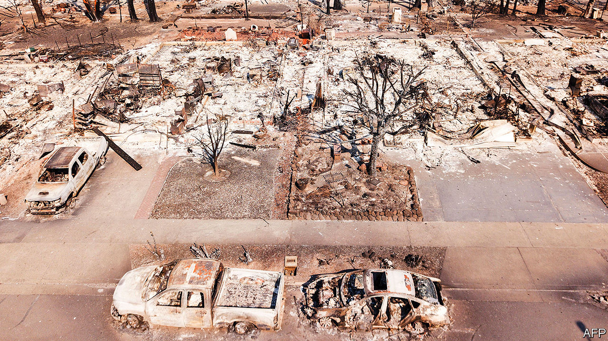
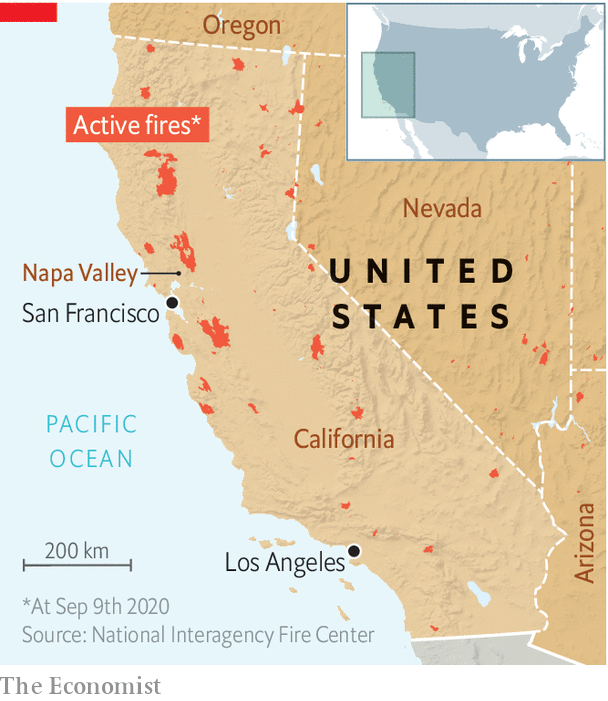

###### Natural disasters

# Wildfires will be more common in a warming world 

##### Clever design of buildings and infrastructure can limit the damage 

 

> Sep 12th 2020 

CALIFORNIA BURNS every year. But amid a record-breaking heatwave, 2020 is the fieriest year yet (see map). As The Economist went to press, more than 7,600 fires had burned over 2.5m acres (1m hectares) of land. The season still has months to run.

That fits a long-term trend, for California’s wildfires are getting steadily worse. Blazes in the 2010s burned 6.8m acres on average, up from 3.3m acres in the 1990s. The fire season lasts nearly three months longer now than it did in the 1970s. Over the past decade, the state has spent an average of $3.7bn a year fighting fires. Add the cost of rebuilding, treating casualties and restoration, says Headwaters Economics, a think-tank, and that is perhaps a tenth of the total cost. Although smaller than this year’s, the 2018 fire season was particularly destructive. It killed 100 people and burned tens of thousands of buildings.


The reason is a double whammy of climate change and development. More homes are being built next to forests, in what experts call the “wildland-urban interface” (WUI). A 2018 study estimated that roughly a third of American homes were in the WUI. The problem is acute in California. Pricey housing has pushed people onto cheaper land close to the wilderness.

 


At the same time, climate change is extending the dry season, which stores up fuel for fires. In California, a chronic “megadrought”—in which dry years become more common and wet ones scarcer—is making matters even worse. One paper, citing tree-ring data, concluded that the drought, which started around 2000, is the second-worst in the past 1,200 years. It, too, has been linked to climate change.

Since neither trend shows much sign of reversing, people on America’s west coast will have to learn to co-exist with more, and more frequent, fires. “It’s not that different to building on an earthquake-prone landscape,” says Max Moritz, a wildfire expert at the University of California at Santa Barbara. Buildings and communities can be built in such a way that fires sweep through them—or better still, around them—leaving them more-or-less intact. Infrastructure can be made more resilient. And forests themselves can be managed to reduce the risk of catastrophic blazes.

Start with the buildings. Most buildings burn not when the flaming front of a fire reaches them, but when embers (also called “firebrands”) thrown off by distant fires land on them. A 2010 paper tracked how a 1991 fire in Oakland Hills burned steadily in a cluster of houses before embers were lifted by strong winds, landing on other houses hundreds of metres away and igniting more than a dozen new “spot fires”. Estimates of the share of buildings lost to firebrands vary, but all are large—between 60% and 90%.

Clever design can help make buildings resistant to fires that spread in this way. Materials such as concrete, adobe or stucco are a better bet than cladding walls in flammable wood. Some composite panels promise to hold back the flames for two hours or more. Gaps under roofs can be blocked up, to stop embers drifting in. Vents can be covered with mesh, or eliminated entirely. Heat-resistant windows, which are less likely to break, help keep firebrands out. Experts recommend a five-foot “non-combustible zone” around the base of homes.

Neighbourhoods can be toughened up, too. In a report published in April, Dr Moritz and his colleague Van Bustic at the University of California in Berkeley describe how entire communities can be planned to resist fires. Building near water is one tactic. But moats are not the only defence. Open agricultural lands—including the vineyards common in the Napa Valley—can offer a useful buffer, too. Even golf courses can serve as firebreaks. Rather than lining the greens with homes, Dr Moritz suggests doing the opposite, and putting houses in the middle.

Burying electricity lines can help avoid blackouts, as well as subsequent costly rebuilding. It can also prevent power lines themselves sparking fires. That is a persistent problem in California, and one which has cost Pacific Gas &amp; Electric, a utility, billions in settlements. Australia, which also suffers from wildfires, has experimented with bunkers specially designed to withstand flames for an hour or more—long enough for a flaming front to move through. These offer a last-resort option for trapped residents.

Sparking a change

But while options exist, adoption is slow. Firewise USA, a volunteer fire-resistance project, was launched in 2002. Nearly two decades later, only around 1,500 communities in America have signed up. One obstacle is the constant maintenance that must be carried out. Vegetation must be regularly thinned. Someone must take responsibility for empty sites. It can be hard to cajole second-home owners, who may visit only rarely, into doing their bit.

Homeowners and contractors often assume that fire-resistant buildings are more expensive, although Headwaters Economics reckons that, for newly built houses, the costs can be comparable. And fire-safe homes often come with secondary advantages, such as greater energy efficiency, which make them cheaper over time. But existing buildings need retrofitting, which comes with a heftier price tag. There are few carrots, and few sticks. The insurance industry offers little relief to those who fire-proof their homes. California’s legal requirements for building in the WUI do not apply to existing buildings. Fire-hazard maps are inadequate.

Perhaps the biggest problem is cultural. “We see the impacts of fires, then turn around and rebuild largely in the same way and the same place, but expect things to go differently next time,” says David Shew, a former staff chief at the Department of Forestry and Fire Protection. “That’s the definition of insanity.” Mr Shew has seen resistance to change at all levels, from homeowners who have strong opinions about materials and aesthetics, to a hidebound construction industry, and even among firefighters themselves.

Still, the measures work. New homes that have adhered to fire codes are far more likely to survive. And some communities are taking it upon themselves to be fire-smart. Circle Oaks is a small community of 180 houses dotted across a steep slope surrounded by tall oaks and madrones. In 2001, recognising their vulnerability, residents began investing around $50,000 to $90,000 each year into a fire-mitigation strategy. Vegetation is regularly cut back, manually or by goats. Extra water is stored on site, ready for firefighting, and hydrants have been upgraded. The residents conduct frequent fire-safety assessments.

At half past midnight on October 9th 2017, they were told to evacuate. A fire on nearby Atlas Peak was heading in their direction. A handful of firefighters, led by Larry Carr, a Circle Oaks resident, did their best to beat back the flames. Circle Oaks’ fire-safety measures greatly aided the efforts—and its houses were saved from one of the worst wildfires to have swept through the region in living memory. ■

For more coverage of climate change, register for The Climate Issue, our fortnightly , or visit our 

