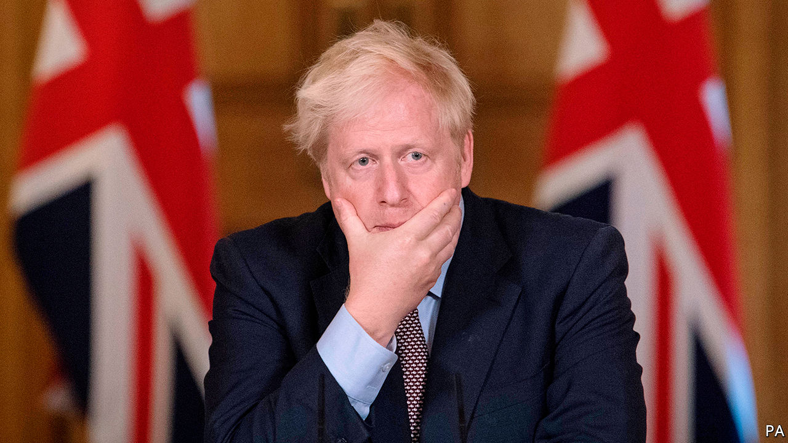
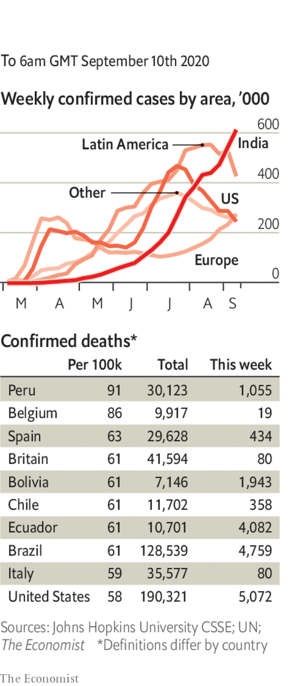

###### 

# Politics this week 

#####  

 

> Sep 12th 2020 

Boris Johnson, the British prime minister, proposed a unilateral change to parts of the Brexit withdrawal agreement related to the Northern Ireland protocol, which averts a hard border with the European Union. There is no precedent for Britain breaching international law in this way. It may be British brinkmanship, as talks over a trade deal continue. But Ursula von der Leyen, head of the European Commission, said it might result in no deal at all. See .

A fire destroyed the largest camp for migrants in Greece, Moria on the island of Lesbos, leaving 13,000 people without shelter. Some 400 unaccompanied minors are being taken to the mainland. It is not clear what will happen to the rest.


Plain-clothes thugs abducted one of the leaders of Belarus’s protests, Maria Kolesnikova. They drove her to the border with Ukraine and tried to expel her, but she tore up her passport to frustrate them. In Minsk, the capital, ambassadors from three EU countries stationed themselves in the flat of another leading protester, a Nobel-prize winning writer, to prevent her arrest. See .

Alexei Navalny, Russia’s main opposition leader who was poisoned last month and medevaced to Germany, was brought out of an induced coma, and was said to be responding to verbal stimuli.

America’s presidential election drew closer. North Carolina began posting ballots to voters who have requested them. Donald Trump urged his supporters to vote by mail and then show up to vote in person, to check whether safeguards against illegally voting twice were in place. Critics said he was trying to cast doubt on the veracity of the result, should he lose on November 3rd. He trails Joe Biden in the polls.

Juan Guaidó, who is recognised by many countries as Venezuela’s interim president, urged a boycott of legislative elections in December, which the dictatorial regime of Nicolás Maduro is likely to rig. Some prominent opposition members may participate anyway. See .

Andrew Holness, Jamaica’s prime minister, was re-elected. His Jamaica Labour Party won 49 of the 63 seats in the lower house of Parliament. Covid-19 suppressed turnout, which fell to 37% from 48% in 2016.

The corruption conviction of Rafael Correa, who was Ecuador’s president from 2007 to 2017, was confirmed by a court. The decision means that Mr Correa cannot carry out his plan to be the running-mate of Andrés Arauz, a left-wing candidate for the presidency.

A court in Saudi Arabia commuted the death sentences of five men convicted of murdering Jamal Khashoggi, a dissident journalist, inside the Saudi consulate in Istanbul in 2018. Prosecutors said Khashoggi’s family agreed to pardon the killers, who were instead given 20-year jail terms. But his fiancée, who lives abroad, said the ruling made “a complete mockery of justice”.

The UN’s nuclear watchdog said Iran has ten times the amount of enriched uranium, a nuclear fuel, permitted under the deal it signed with world powers in 2015. Iran would need to enrich the uranium further, a long process, to make a bomb.

Donald Trump brokered a deal between Kosovo and Serbia that, among other things, would see both countries establish embassies in Jerusalem. That provoked a warning from the EU, which the Balkan states hope to join: it wants the status of Jerusalem to be worked out in peace talks. See .

West Africa’s regional bloc, ECOWAS, said it will impose more economic sanctions on Mali unless the leaders of a coup hand power to civilians by September 15th and pledge to hold elections within a year.

The Tigray region of Ethiopia defied the central government by holding state elections, putting further strain on an already troubled federation. Voting across the rest of the country has been indefinitely postponed because of covid-19.

Police in Hong Kong arrested nearly 300 people during protests against a new national-security law and the postponement of elections for the Legislative Council.

Two Australian journalists in China sought refuge in diplomatic missions after police knocked on their doors at midnight. They were told they would be questioned about a third Australian citizen who is being held on national-security grounds. They agreed to be interviewed on condition that they were allowed to leave the country, which they did. No Australian news media remain in mainland China. See .

Troops from China and India exchanged fire across their disputed border in the Himalayas for the first time since 1975. The two nuclear powers, who fought a brief war in 1962, both say they want to lower tensions; each accuses the other of stoking them. See .

A politician sentenced to death for murdering a member of a rival party was brought from prison to be sworn in as an MP for Sri Lanka’s ruling party.

Amrullah Saleh, Afghanistan’s vice-president and an opponent of the Taliban, survived an assassination attempt that killed ten bystanders. The Taliban, which is due to begin peace talks with the government, denied responsibility.

Coronavirus briefs

 


A promising trial of a vaccine that AstraZeneca is developing with Oxford University was temporarily put on hold after one of the volunteers fell ill. 

Social gatherings of more than six people were banned in England after a surge in the disease, notably among gregarious young people.

The number of new daily infections in the United States fell below 30,000 for the first time since June.

In South Africa new cases dropped under 1,000 a day. In July they averaged 11,000. 

Emmanuel Macron urged people to be “collectively much more responsible” as the number of deaths in France crept up to levels last seen in June.

Wearing a face mask in shops and public buildings became mandatory again in the Czech Republic. The stipulation had been lifted in July.

