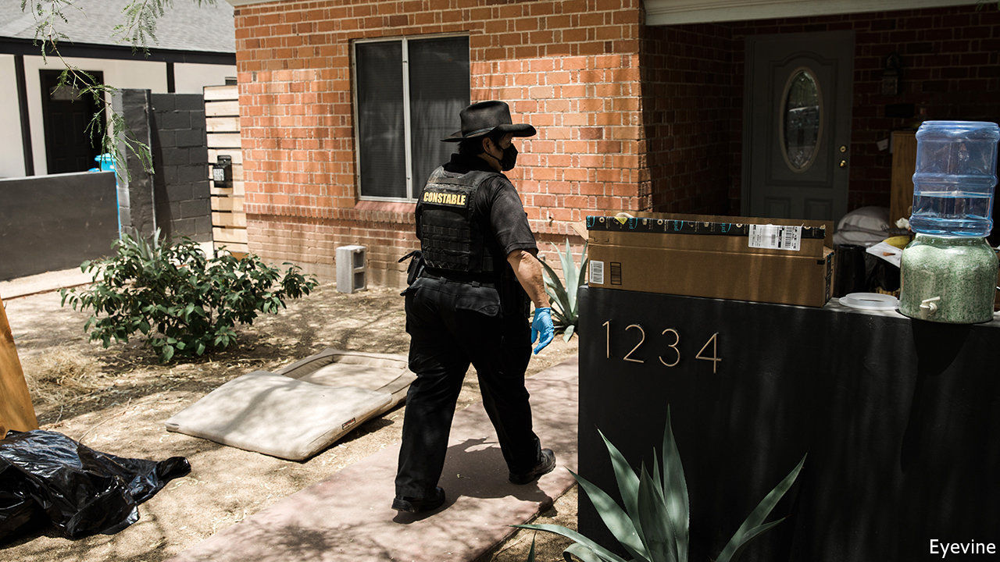
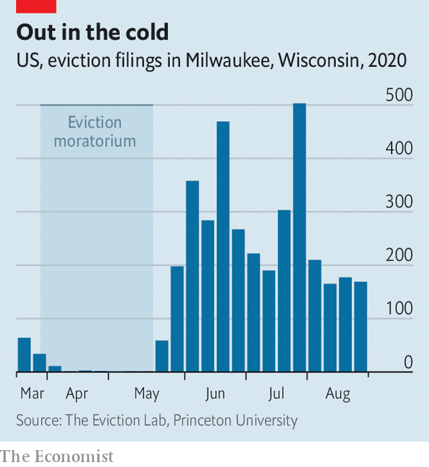

###### Shelter in place

# Can the Trump administration halt evictions on public-health grounds? 

##### The CDC’s decree on evictions will be challenged in court 

 

> Sep 12th 2020 

EVEN IN NORMAL times, attending housing court in America is a dispiriting encounter with the judicial system. The justice dispensed looks much like a conveyor belt. Few tenants can afford lawyers to challenge the eviction orders sought by their landlord (unlike criminal proceedings, there is no right to counsel). Many do not show up on the day, so the judge enters default evictions for them en masse. Even more dispiriting would be the spectacle of a judge pronouncing a family’s eviction by video conference in the midst of an epidemic that has killed 190,000 Americans.

Fortunately that remains rarer than the weakened economy—with 11m fewer Americans working than in February, and an unemployment rate of 8.4%—might suggest. Many cities and states issued moratoriums when it became clear that the epidemic would result in a lot of missed rent payments. The CARES Act, the enormous stimulus package passed by Congress, included an eviction moratorium for federally subsidised housing. Though it covered fewer than half of renters in the country, advocates cheered the measure before it expired on July 24th (generous federal unemployment benefits of $600 a week also expired soon afterwards).


Congress has been unable to come up with a second stimulus bill, even though Democrats and Republicans agree that one is necessary. That prompted worries of a tsunami of eviction filings. In Philadelphia, 17 protesters were arrested for blocking the entrances to court a few days after the state moratorium expired. In some cities, like Milwaukee, evictions quickly rebounded after coming to a halt (see chart). Since there seems more hope of an October vaccine than a second stimulus, the consequences looked grim.

 


A deus ex machina of sorts has come from the Centres for Disease Control (CDC), the federal public-health agency that is occasionally the target of the president’s scorn. Arguing that evictions hasten the spread of the virus, it issued a sweeping moratorium starting on September 4th that applies to most renters nationwide (excepting American Samoa, which has been spared even a single case of covid-19). This came after an executive order from President Donald Trump that sought to “take all lawful measures to prevent residential evictions and foreclosures”. To qualify, renters must certify that they earn less than $99,000 and are unable to pay even after seeking government assistance. However, they must still make “timely partial payments” and will still owe back-rent.

The public-health rationale for the decision is straightforward. A team of epidemiologists at Harvard, the University of Illinois and the University of Pennsylvania has published a model estimating that even a low eviction rate (0.25% of households per month) would increase caseloads by 1.5% by the end of the year. But a high eviction rate (2% of households per month) would increase cases by 13%. The non-medical consequences of pausing evictions could prove equally important. Studies of the last recession showed that moving several times a year was associated with worse performance at school, the effects of which linger over a lifetime. And since evictions are caused by a failure to pay rent, reduced housing costs may allow increased spending on other necessities for struggling families.

Although the CDC order is doubtless well-intended, whether it will be judged legal is still uncertain. The latitude given to public-health officials to contain an epidemic is broad, but this kind of action has no recent precedent. Without any immediate compensation for lost rental payments, landlords will be left with mounting bills. Arguably, this stands awkwardly with the constitutional guarantee that “private property [shall not] be taken for public use, without just compensation”. Indeed, there is already a lawsuit against the city and state eviction moratoriums introduced in Seattle, Washington, on this ground. One of the plaintiffs in that case is owed $14,000 from two tenants who stopped paying rent in April.

Tenant advocates and landlord-lobby associations, usually at loggerheads, agree on one thing—they would rather the federal government footed the bill. The stimulus proposal created by Democrats in Congress would set aside $100bn to help pay for six months of back-rent and late fees, but its actual passage looks improbable. Others would like to go further. Housing Justice for All, a New York group, would like all housing costs (including utilities) incurred during the epidemic to be “automatically forgiven and never owed”. Left-leaning state legislators have introduced a bill that would do almost exactly that.

Nothing spurs policy innovation quite like a crisis. During the second world war America imposed extraordinary rent controls covering more than 80% of the national rental stock. Today, some would like to supplant national rent control with national rent cancellation.■

Editor’s note: Some of our covid-19 coverage is free for readers of The Economist Today, our daily . For more stories and our pandemic tracker, see our 

