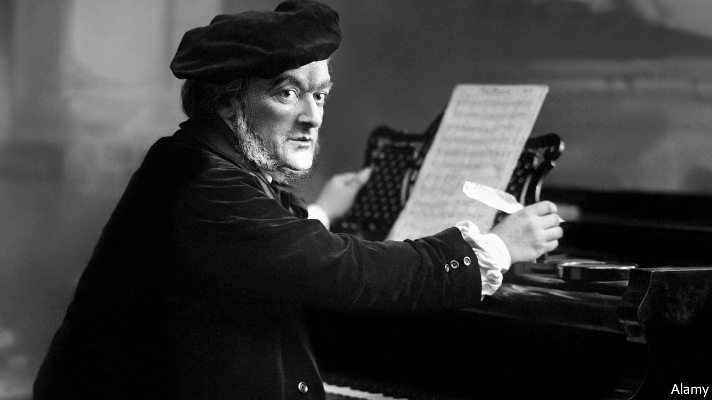

###### A hateful beauty

# Opera, Nazism and Richard Wagner’s painful legacy 

##### Alex Ross is no Wagner apologist. In “Wagnerism” he instead offers a “passionate ambivalence” 

 

> Sep 19th 2020 

Wagnerism: Art and Politics in the Shadow of Music. By Alex Ross.Farrar, Straus and Giroux; 784 pages; $40. Fourth Estate; £30.

HITLER CASTS as long a shadow over Richard Wagner as Wagner casts over art. So argues Alex Ross, the music critic of the New Yorker, in his gigantic new book, “Wagnerism”. Fifty years after the German composer’s death in 1883, his operas became “the chief cultural ornament of the most destructive political regime in history”. Yet, says Mr Ross, the Nazis made use of Wagner “only when he was shorn of his ambiguities, and even then his presence in mainstream Nazi culture was less pronounced than many accounts let on”.


The author is no apologist. He probes Wagner’s anti-Semitism, which included a vile essay of 1850 called “Jewishness in Music” as well as caricatures such as the dwarves in the “Ring” cycle. In Wagner’s lifetime, “Parsifal” was perceived by the writer Paul Lindau as “Christianity in Music”—the Christianity, that is, “of the Spanish Inquisitor, which burns heretics while the pure voices of children praise God’s mercy”. By the end of the 19th century, Mr Ross recounts, scholars were arguing that as well as containing anti-Semitic stereotypes, the operas embody what one critic has called an “aesthetics of anti-Semitism”.

Through the Meister’s family and various unsavoury boosters, Mr Ross traces the links between the Third Reich and Bayreuth, Wagner’s eventual home and the spiritual abode of his music. But the book is more than either a prosecutor’s brief or a case for the defence. Instead Mr Ross offers a “passionate ambivalence” as he charts Wagner’s vexed legacy, which loomed over Modernism and fin de siècle Europe.

The use of heroic characters, massive scale, Nordic myth and leitmotifs appealed to contemporaries like Nietzsche and Baudelaire, novelists such as J.R.R. Tolkien, and generations of film-makers. Not everyone applauded: Tolstoy described “Siegfried” as a “stupid puppet show not even good enough for children”. But, love him or hate him, Wagner has been unavoidable. Mr Ross ranges widely over his impact—sometimes too widely. A plunge into “Finnegans Wake” by way of opera is soporific.

Hitler admired Wagner as a musician first and a thinker second. In the early 1920s he kept a stack of the composer’s records in his flat in Munich. Yet, says Mr Ross, his enthusiasm was more intoxicated than insightful. The Führer seemed to overlook Wagner’s preoccupation with love. The “Ring” critiques power; for all its Aryan overtones, “Parsifal” elevates compassion. Wagner’s heroes struggle with remorse—hardly a Nazi virtue. Missing all this, Hitler blathered about hearing “the rhythms of the primeval world”.

Beyond his unyielding anti-Semitism, Wagner himself was politically incoherent. He flirted with anarchism, socialism, communism, pacifism and Utopianism, drifting left as he grew older (the funeral music from “Siegfried” was played at a concert commemorating Lenin’s death). Nazi leaders had to be seen at the theatre in Bayreuth, but opera’s narrow appeal, as well as Wagner’s mixed-up views, limited his music’s value in Nazi propaganda.

Still, Wagner provided the soundtrack and iconography of the Nazi war machine—and eventually of warfare itself. In a fascinating passage on “Apocalypse Now”, Francis Ford Coppola’s film of 1979, Mr Ross describes the famous role of “Ride of the Valkyries” in a sequence depicting a helicopter attack on a Vietnamese village. “A grand indictment of American hubris is intended”, he writes, “yet the visceral impact of the film-making saps its capacity for critique.” A later film, “Jarhead”, shows young troops revelling in the scene. Real-life American vehicles blared the music during missions in Grenada and Iraq.

How far art and artist can be separated is an age-old question. In Wagner’s case, the art can itself be racist and bombastic. His avowed prejudice taints it further—for some, unforgivably. For others, the power of his operas overrides such objections. By presenting an honest assessment of the problem, “Wagnerism” supplies, if not answers, then at least the right questions. ■

