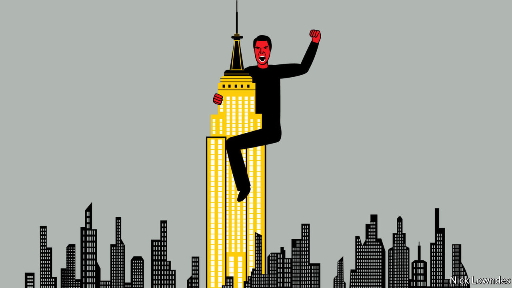

###### Johnson

# Pride, prejudice and the story of New York English 

##### Some Americans look down on New York accents. New Yorkers don’t care 

 

> Sep 19th 2020 

THE MOST effective form of birth control known to man, said Lewis Grizzard, is a Bronx accent. The late newspaper columnist from small-town Georgia enjoyed teasing northerners. But it is hardly just American southerners who take digs at New Yorkers’ English. “Coffee Talk”, a venerable sketch on “Saturday Night Live”, a long-running comedy show filmed in the city, featured few memorable jokes per se, instead leaning heavily on exaggerated vowels like those in “cawfee” and “tawk”. The accent itself was the punchline.

There are, in fact, many New York accents: African-American and Puerto Rican New Yorkers do not talk like Woody Allen. The city has been replenished by a constant stream of immigration (foreign and domestic) since its founding. When Nicolas Heller, a film-maker, recently held a competition on Instagram to find the best New York accent, hundreds of entries were submitted, reflecting that whole rich spectrum. As an account of the contest in the New York Times put it, New York English is not a single accent but rather “a baseline indignation…as if the speaker can’t quite believe there’s even a need to have the conversation”.


In her new book, “You Talkin’ to Me?”, E.J. White of Stony Brook University celebrates the disputatious, never-let-them-call-you-a-sucker language that is New York English. Ms White reckons a conversational manner that might be called “assertive” by, say, polite Britons, is, for New Yorkers, not rude but the opposite: a sign of engagement, and therefore of warmth. Patient, slow-paced styles can, to the New Yorker, seem aloof.

In New York, as in Britain, accent signals class. The Cawfee Tawk accent, in particular, is working-class, but there was once an aristocratic New York speech which it echoed. Like the working-class kind, this was r-less: think of upper-class Franklin Roosevelt’s “the only thing we have to feah…” It shared the round vowel of “toity-toid’ (“thirty-third”); Teddy Roosevelt, Franklin’s distant cousin, said “burn” a bit like “boin”. But high-class New Yorkers also shared traits with British speakers, such as keeping the t-sound in “butter” (“buddah” in Cawfee Tawk).

In elocution classes in the mid-20th century, many Americans were still taught a version of English that in some ways mimicked upper-class New Yorkers. But then, Ms White argues, people elsewhere began to see the city as an alien immigrant entrepôt. This dragged down the image of the city’s accent; Teddy Roosevelt’s “boin” became associated with the poor. The locus of “true” American speech, in the popular mind, became the Midwest, with its hardy northern European Protestants and their r-laden speech. This is why today’s “General American” sounds more like Nebraska than New York. Ms White notes that in the recent “Avengers” films, Captain America, though brought up in Brooklyn in the 1930s, speaks General American. Clowns and villains tawk like Brooklyn; superheroes, never.

William Labov, a linguist, pioneered the field of sociolinguistics by rigorously studying the New York accent, not least in an experiment he conducted in 1962. He went to a high-class department store (Saks), a middle-class one (Macy’s) and a working-class one (S. Klein, now defunct). In each he asked where to find an item he knew was on the “fourth floor”.

Sure enough, the “r” in both words was least often pronounced in S. Klein, and most in Saks, even though the employees all came from the same social milieu. New Yorkers know how their accent is perceived; those working in Saks buttoned up their English. So did many participants when Mr Labov asked them to repeat themselves, pronouncing the “r” the second time around as his “Excuse me?” made them self-conscious. A recent recreation of Mr Labov’s experiment looked at episodes of “Say Yes to the Dress”, a television show that followed shoppers at a New York bridal store. Sure enough, assistants emphasised their “r”s when serving customers with bigger budgets.

In many countries, the speech of the grandest or most powerful city is the most prestigious—think of Parisian French. Yet many Americans despise the accent of their country’s biggest city. New Yorkers don’t care. Mr Labov introduced the idea of “covert prestige”: that even derided accents and dialects have a value to their speakers, as a key to their identity and a store of values and connections. New Yorkers may sometimes sound as if they hate each other. Deep down they know they live not in the capital of the United States, but of the world.

