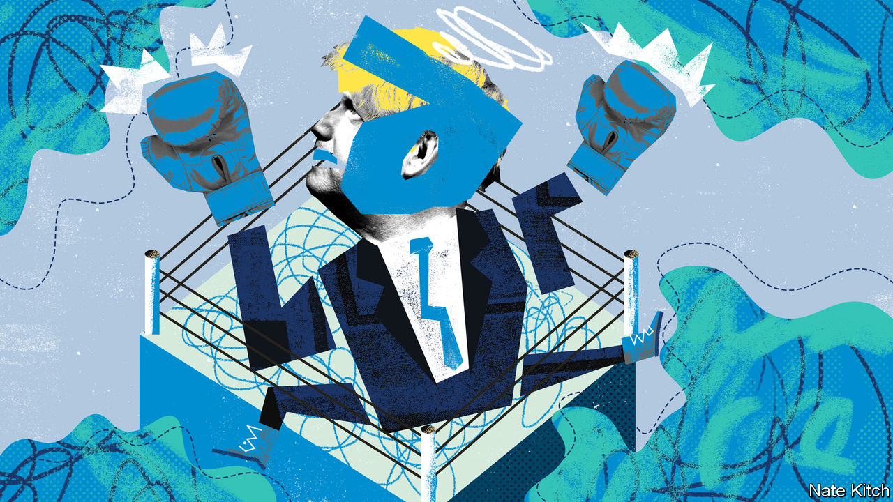

###### Bagehot

# Boris v the blue blob 

##### The list of institutions Boris Johnson is at war with includes the Conservative Party 

 

> Sep 17th 2020 

IN A ZOOM call with 250 Conservative MPs on September 11th Boris Johnson pleaded with his party not to return to “miserable squabbling over Europe”. The government handily won the division over the second reading of its controversial internal-market bill, but the squabbling continued regardless. Senior Conservatives fulminated against the legislation. More than 20 Tory MPs refused to back the government on the issue. Even loyal Brexiteers such as Michael Howard and Norman Lamont were indignant

As The Economist went to press, it looked as if the government had backed down. Mr Johnson promised “an extra layer of Parliamentary oversight”—in other words MPs, rather than the government, would have the final say on whether Britain violates international law by overriding the withdrawal bill it agreed with the European Union in January. It is not clear whether this will placate Parliament. It will certainly not placate the EU.


What is clear is that Mr Johnson’s relations with Conservative MPs are dismal. The list of senior Tories who spoke out against the internal-market bill includes five former Tory leaders, two former chancellors, two former attorneys-general, two former Northern Ireland secretaries and the government’s law officer for Scotland, who resigned despite the government’s last-minute climb-down. Tories with legal training are particularly worried because, as well as naturally revering the law, they are bound by their professional oath to uphold it.

The tensions are not confined to the current bill. Several cabinet members have expressed doubts about the “rule of six” (which prevents groups of more than six people gathering). Many heads of select committees are critical of the government. Some 50 backbench MPs publicly called for Dominic Cummings, Mr Johnson’s right-hand man, to resign after he broke lockdown rules; many others expressed the sentiment in private. Everybody is worried about the government’s lacklustre handling of the pandemic.

This is quite some turnaround. It is only nine months since Mr Johnson led his party to an extraordinary election victory, which increased his working majority to 87, shifted the balance of power in his party to Brexiteers, sealed his reputation as a political miracle-worker and supposedly launched a new era in British politics. Why has the conquering hero lost his shine? And why is a party with a bomb-proof majority worrying about defeat over a vital bill?

Rebellion is habit-forming—and the Conservative Party has acquired a serious habit during the Brexit years. These years taught the lethal lesson that disloyalty rather than loyalty can be the path to success. Mr Johnson was himself a serial rebel who resigned as foreign secretary over the withdrawal bill. The cabinet is stuffed with Lazarus-like figures who have either resigned or been sacked or both. And big majorities are double-edged swords: they reduce the pressure to conform (because your vote is unlikely to be crucial) and bring in eccentrics and no-hopers (who will never have a sniff at high office).

The party has also been in power for a decade. This means that there are plenty of people who have nothing to lose from rebelling, either because they have had their turn in office (Damian Hinds), or because they have been chucked out by the current leadership (Sajid Javid) or because they have grown tired of the bridle and whip (Sir Roger Gale). In parliamentary politics, time is the opposite of a healer. It foments resentment, breaks friendships and nurtures revolts. Mr Johnson’s misfortune is that he comes at the end of a long and fractious period of Conservative power.

Messrs Johnson and Cummings have also done their bit to sour relations. Mr Johnson owes his position at the top to his star power, rather than to his record as a party man. But his star power is waning under the pressure of high office. His performance in Parliament has been consistently poor. This week he crumbled before a fusillade from Ed Miliband, Labour’s shadow business secretary. Mr Cummings makes no secret of his belief that most MPs are mediocrities. Sir Charles Walker summed up many MPs’ feelings about Downing Street this week: “If you keep whacking a dog, don’t be surprised when it bites you back.”

Who’s a good boy?

The government’s decision to stroke the parliamentary dog may help in the short term. But the deeper problem is not parliamentary management. It is the nature of Brexit itself. Previous revolutions of this scale have been carefully prepared. The post-war Labour government could draw on decades of cross-party thinking. “When Labour swept to victory in 1945”, the historian Paul Addison wrote in his study of the subject, “the new consensus fell, like a branch of ripe plums, onto the lap of Mr Attlee.” The Thatcher government could draw on detailed free-market policies prepared by think-tanks like the Centre for Policy Studies, as well as the wisdom of Friedrich Hayek and Milton Friedman. The Brexiteers, by contrast, were united by what they were against rather than what they were for. The Brexit army contains protectionists and free-marketers, fishermen and financiers, single-issue fanatics and philosophical radicals. The government’s troubles stem from its attempt to impose a governing philosophy on this rag-tag army; a philosophy, moreover, that is an eccentric mixture of state interventionism, grands projets and traditional Thatcherism.

Brexit is an inherently revolutionary project that keeps pushing its supporters in unexpected directions. Who would have thought four years ago that Brexit would mean leaving both the single market and the customs union? Who would have thought a couple of months ago that Britain would be locked in a fight with the EU over state aid? The strange sight of Brexit pioneers such as Lords Howard and Lamont denouncing the government is the staple of revolutions down the ages: the eating of children. There will be plenty more Tory children eaten before this revolution has reached its conclusion. ■

