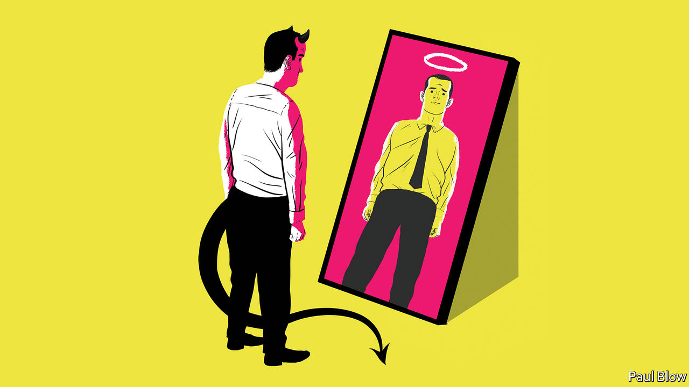

###### Bartleby

# How do you stop corporate fraud? 

##### The only way is ethics 

 

> Sep 19th 2020 

CORPORATE SCANDALS occur with depressing regularity, from the accounting misstatements at Enron in 2001 to fake bank accounts at Wells Fargo, uncovered in 2016. In June Wirecard, a German payments processor, revealed that €1.9bn ($2.3bn) was missing from its accounts. What was remarkable about the affair was that the company’s book-keeping had been the subject of sceptical articles in the Financial Times. Yet the initial reaction of BaFin, the German regulator, was to launch an investigation into the newspaper, not the firm.

It is clearly difficult for people to recognise when a business is heading off the rails. That can be just as true for managers within a business as for people outside it. Executives can be sideswiped by an unnoticed problem in an individual division or a subsidiary; not all scandals make it on to the front pages.


Outright malice is not always the cause. Ethical choices are rarely black or white and individuals are not very good at assessing the purity of their own motivations. In a new book about behavioural biases, “You’re About To Make A Terrible Mistake”, Olivier Sibony of HEC business school in Paris writes that “as soon as there is any ambiguity about a judgment…we reason in a way that is selective enough to serve our interests and yet plausible enough to convince others (and ourselves) that we are not intentionally distorting the facts.” Individuals’ choices are also governed by how others behave; people are more likely to break the speed limit if everyone else is doing so.

Philosophers call morally ambiguous decision-making within such internal and external constraints “bounded ethicality”. Inside companies, it can easily mean that a culture of cheating can spread quickly. A seminal paper* by academics at Columbia and Harvard business schools looked at how, in the light of this problem, companies might reduce cheating within their ranks.

Their first finding was that individuals are more likely to lie, or commit fraud, when they are set excessively difficult and specific goals. Bounded ethicality, the authors argue, can also operate at an unconscious level. Under pressure, people often do not efficiently analyse information that could otherwise keep them on the straight and narrow.

The problem is exacerbated by confirmation bias, a human tendency to seek out facts that back up their pre-existing preferences. Research has found that people given a specific performance target (to reach a 12% annual return over the investment horizon, for example) were more likely to overlook important information about the future performance of investment funds and excessively focus on past performance data.

As a result, the authors suggest, “Organisations might decrease intentional unethical behaviour by defining their goals more broadly and by setting goals at levels that are perceived as fair and relatively attainable by employees.” Another tactic is for managers to signal clearly that ethical issues may arise, so that people take them into account when making decisions. In one study, drivers were found to be more honest in reporting their car mileage when they signed an ethics code of conduct at the top of a mileage form (before they entered the distance on the form) than at the bottom (after the figure had been recorded).

The Columbia and Harvard researchers conducted a test asking people to act as financial advisers and pick from a range of funds. One part of it used the raw data from funds operated by Bernie Madoff, convicted in 2009 for defrauding investors. The participants did not know the data came from a fraudulent fund. But they did see its high returns and the opaque way it operated. One group was simply asked to recommend a fund; another group was asked to consider which fund made them most suspicious before making their recommendation. The result of this intervention was to decrease the proportion of individuals recommending Mr Madoff’s funds to their clients from 68% to 51%.

This figure is still staggeringly high, of course. It might have been reduced further, the academics suggest, if participants could have asked more questions and got more information. Too often, people rush to judgment, which leads them to play down the risks they are taking and the corners they are cutting. And that means scandals are inevitable.


