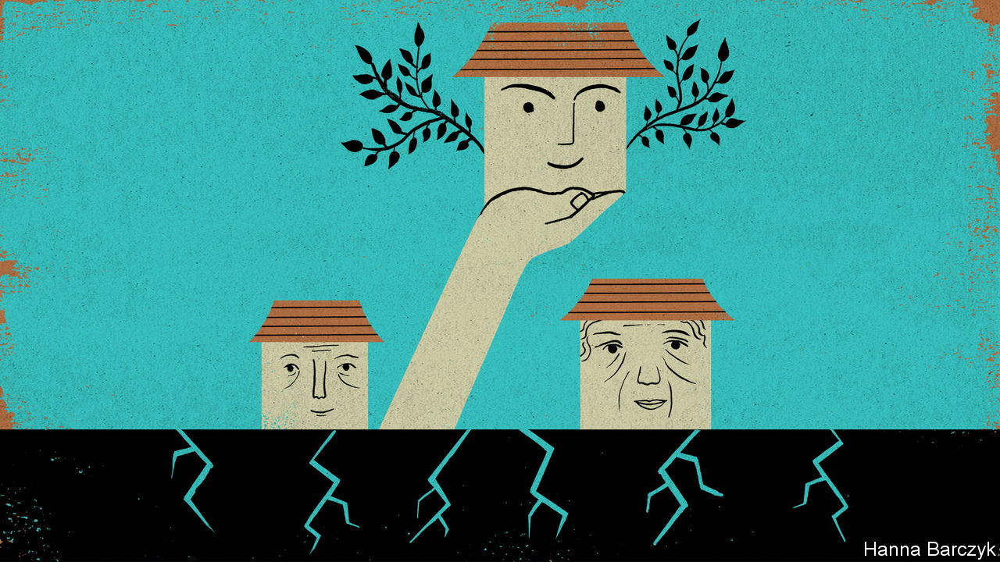

###### The landlords are back

# The families of China’s pre-Communist elite remain privileged 

##### The old elite suffered under Mao, but their descendants are prospering 

 

> Sep 19th 2020 

THESE DAYS the Chinese Communist Party prefers to play down the horrors unleashed by Mao Zedong’s Cultural Revolution of the 1960s and 1970s. But a rare chronicle of the period by a writer based in China, “The World Turned Upside Down”, describes the chairman’s harsh campaign to reorder Chinese society in vivid detail. (An English version will be published in January; like the Chinese original, it will be banned in mainland China.) The title of Yang Jisheng’s book well conveys the experience of those who enjoyed privilege in the pre-Communist era, who were brutally persecuted under Mao.

The old elite began to suffer almost as soon as the Communist Party won the Chinese civil war in 1949. China’s new rulers quickly set about seizing land from people in the countryside, redistributing it among the landless, confiscating private businesses and executing many rural landlords and people who had worked for the overthrown Nationalist regime. The Cultural Revolution appeared to be the nail in the coffin of an entire social class.


But in a working paper titled “Persistence through Revolutions”, a group of scholars based in America, Britain and China find that Mao’s social re-engineering had a less lasting impact than might be supposed. The grandchildren of the pre-Communist elite have largely regained the status their families once enjoyed. They are a lot more educated and wealthy than other households. Their values and attitudes also differ from the descendants of those who had lower social standing before 1949. They are less bothered by inequality, more entrepreneurial, more pro-market, and more inclined toward individualism and a belief in success through hard work.

Led by Alberto Alesina of Harvard University (who died in May), the academics mined data from household surveys, census reports and land records. They found that by 2010 the incomes of descendants of the pre-Communist elite were 16-17% higher than those born into families that were underprivileged before 1949. They were also more likely to have completed secondary and tertiary education. They performed significantly better in maths tests.

The scholars offer several possible explanations for the relatively swift restoration of advantage to the old elite. Hidden wealth—hoarded by relatives outside mainland China—may have helped. But more important was the enduring strength of family networks inside the country. The rebound of wealth among descendants of the former elite, the scholars write, has been found almost exclusively in villages with a strong clan-based social structure (there are many such in China). The researchers suggest that despite the upheavals of the Mao era, parents were still able to transmit their high-status mindsets to their offspring. Less than 45 years after Mao’s death, the toppled elite have managed to seize society’s summit again.

