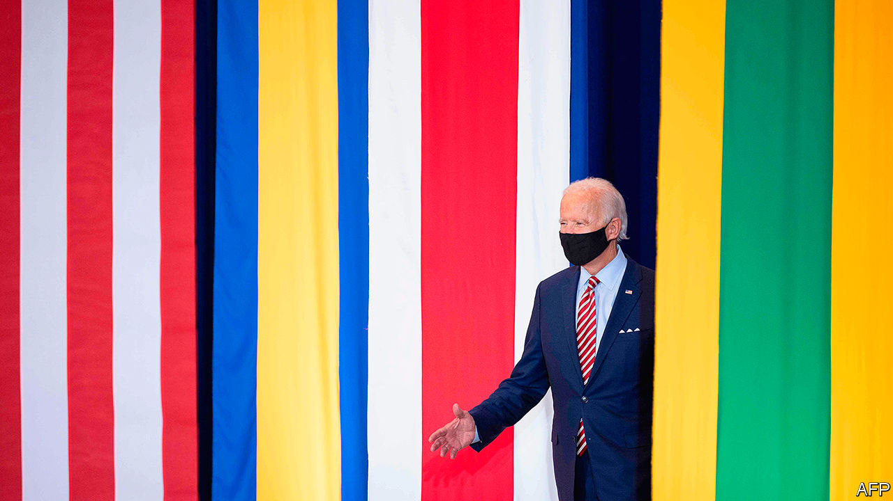

###### Continuity candidate

# How would Joe Biden change America’s trade policy? 

##### Less than America’s trade partners might hope 

 

> Sep 19th 2020 

ON THE SUBJECT of trade policy, America’s Democratic presidential nominee, Joe Biden, has been sounding rather like President Donald Trump. He claims that “economic security is national security”, promises to create millions of manufacturing jobs and pledges to reduce America’s dependence on China. On September 9th he published his “Made in America” plan, only for the White House to tell Fox News that it would host its own “Made in America” day on October 5th. America’s trading partners hoping for change may dismiss Mr Biden’s tough talk as campaign chatter. That would be unwise.

Mr Biden would bring some changes, of course. Policy would be more consistent. Trade officials in Mexico and the European Union (EU) could stop following presidential tweets so avidly. Having slammed Mr Trump’s “empty” agreement with China, Mr Biden seems unlikely to strike shallow, transactional deals. In fact, despite his reputation for liking them, he may not agree to any at all. They can wait, he has said, until after “we have invested in Americans”.


Trading partners may hope that America stops applying new tariffs. They should manage their expectations. Mr Biden is no “Tariff Man”, as Mr Trump once proclaimed himself to be. But he has pledged to restrict imports from China that are deemed to be a national-security threat. Countries that do not live up to their environmental obligations could face a carbon-adjustment fee in the form of tariffs or quotas.

Mr Biden sees as big a role for the government in supporting American manufacturing as Mr Trump does, perhaps a reflection of the fact that industrial policy is now in favour across the political spectrum. Mr Biden’s plans to strengthen “Buy American” rules would make it harder for the government to buy foreign cement, steel and equipment. Peter Navarro, Mr Trump’s trade adviser, would be proud.

Robert Lighthizer, America’s chief trade negotiator, reportedly expressed his unhappiness with the Agreement on Government Procurement, an international deal designed to prevent governments from imposing restrictions on how public funds are spent. Mr Biden promises to rewrite the rules, so that America and its allies can “use their own taxpayer dollars to spur investment in their own countries”.

Moreover, Mr Biden has committed himself to using a broader range of tools than Mr Trump’s tariffs. He plans to spend $300bn of public funds to support research into artificial intelligence, electric vehicles and 5G. A “clawback” provision would make companies shipping jobs overseas hand back the subsidy. Some governments will see this as unfair: foreign companies facing subsidised competitors will find it as difficult to break into the American market as if they were facing tariffs. Others will take it as permission to hand out subsidies of their own. Either approach will breed tension. Mr Biden has pledged to fight back against countries undercutting American manufacturing using “unfair subsidies”.

Mr Biden’s silence on two matters has led to foreign suspicions of yet more continuity. The first relates to the World Trade Organisation (WTO), which the Trump administration has hobbled by breaking its system of solving trade disputes. (A WTO judgment on September 15th that American tariffs on Chinese imports broke its rules will not whet the administration’s appetite for a fix.) The EU, which sees dispute settlement as integral to the rules-based trading system, wants to repair the mechanism. Mr Biden has not yet said if he will join in.

The other matter is what Mr Biden will do with the tariffs imposed by Mr Trump. He has criticised them without pledging to remove them. Strategy might play a role: a Biden administration may want to dangle tariff reductions in return for concessions abroad. To America’s trading partners, that would feel rather familiar. ■

Dig deeper:Read the  and our , then sign up for Checks and Balance, our  and  on American politics.

