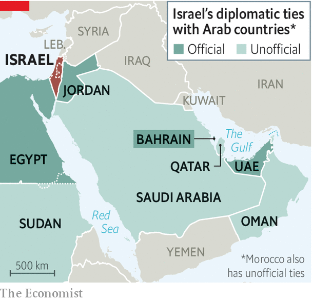

###### End of the illusion

# The Arab-Israeli conflict is fading 

##### But that will not resolve the one with the Palestinians 

 

> Sep 19th 2020 

SEVEN DECADES of official ostracism ended with a few strokes of a pen. On September 15th, at a ceremony in Washington (pictured), Bahrain and the United Arab Emirates (UAE) established formal diplomatic relations with Israel. They are the first Gulf states to do so. The documents they signed were thin: details of flights, commerce and the exchange of ambassadors must be worked out. Still, in one afternoon, Israel doubled the number of Arab countries with which it has official ties. It also has informal relations with at least five others, from Oman to Morocco.

It was a genuine achievement for President Donald Trump, whose attempts at high-stakes diplomacy have been marked more often by stalemate than success. For Binyamin Netanyahu, Israel’s prime minister, it validated a long-held belief that his country would not have to make peace with the Palestinians to enjoy better regional ties. (It was also a welcome excuse to get out of Israel, where covid-19 cases are surging and the public is furious about a newly imposed three-week lockdown over Judaism’s holiest festivals.)


There was much talk of peace, as if a long, vicious war had finally ended. “It’s been blood all over the sand for decades and decades,” Mr Trump said. “That’s all they do is they fight and kill people.” In fact, Israel never fought Bahrain or the UAE; neither was even a sovereign state until more than two decades after Israel’s founding. They have been quiet partners for years, brought together by a mutual fear of Iran.

The Emiratis moved first to make that partnership public, but Bahrain’s decision to follow suit may be the more interesting one. The UAE did not have to worry about whether normalisation would be popular. It is strong enough to brush off criticism from countries such as Iran and Turkey (which itself recognised Israel in 1949). At home there is little space for dissent. One prominent Emirati academic, known for past criticism of Israel, tweeted a tearful emoji when the UAE announced its decision last month. He has since reaffirmed his support for the country’s leadership.

Bahrain, by contrast, has a history of protest. The Shia majority has long complained of discrimination by the Sunni royal family. Unrest peaked in 2011 during protests inspired by the Arab spring, which were crushed with the help of troops from other Gulf countries. Opponents of normalisation with Israel have more room to express dissent in Bahrain, although the most strident critics risk arrest. There was an outpouring of discontent on social media in the days before the ceremony.

The reaction will be watched closely in Saudi Arabia. Bahrain relies on its larger neighbour for political and economic support. It would not have made such a consequential decision without the kingdom’s blessing. It may serve as a test run. Mr Trump has hinted that Saudi Arabia could be next. The crown prince, Muhammad bin Salman, may see a way to polish his reputation in Washington, which has been blackened by the war in Yemen and the murder of Jamal Khashoggi, a Saudi journalist. For now, though, King Salman sits on the throne. He hews to the old Arab orthodoxy of offering Israel full relations only if it withdraws from Palestinian lands.

 


Bahrain and the UAE settled for much less. The Emiratis did extract a promise that Israel would shelve plans to annex parts of the occupied West Bank. In their telling, they now have more leverage to push for a two-state solution. “The policy of the empty chair has not served the Palestinians well, and indeed has not served the Arabs well,” says Anwar Gargash, the UAE’s minister of state for foreign affairs.

History suggests such leverage will count for little, though. Egypt and Jordan signed peace treaties with Israel decades ago but have not brought the Palestinians any closer to statehood. The treaties that Israel signed with Bahrain and the UAE did not even include a nod to a two-state solution, only vague talk of a “just” resolution.

The autocrats who gather at Arab League gabfests still recite paeans to the Palestinian cause. Out in the real world, though, the Arab-Israeli conflict has long since ebbed. Almost four decades have passed since a regular Arab army fought Israel. It is hard to say precisely how the Arab public feels, as dictatorships do not lend themselves to credible polling. Most Arabs no doubt remain sympathetic to the Palestinians. But there has been a gradual softening of opinion. Most Arab states are suffering from political and economic crises, exacerbated by a power struggle between Iran, Turkey and the Gulf states; the Palestinian cause no longer arouses the passions it once did.

Mr Trump thinks there will be more diplomatic announcements to come. “We’ll have at least five or six countries coming along very quickly,” he said. A bit of Trumpian exaggeration, perhaps, although others will surely follow and the Palestinians will find themselves ever more isolated. Yet the loss of Arab support will not compel them to abandon their demands. Strip away the façade of an Arab-Israeli conflict, and the problem remains what it always has been: a territorial dispute between two peoples that only they can resolve. ■

