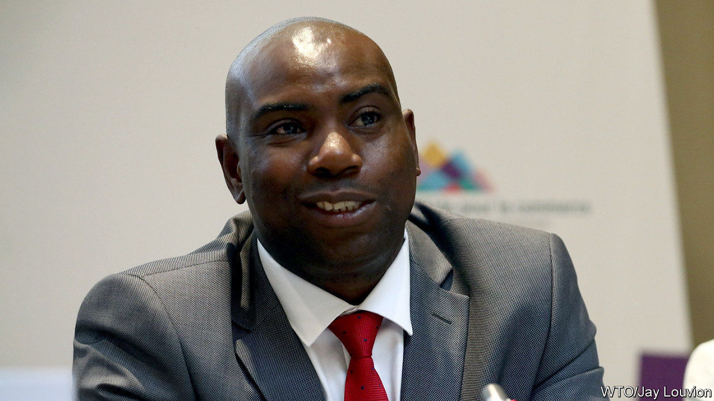

###### A president who floats above the fray

# Uganda’s ruling party is fractious and disorganised 

##### But it suits President Yoweri Museveni that way 

 

> Sep 19th 2020 

DICKSONS KATESHUMBWA is shaking up politics in Sheema, a district in western Uganda. In his bid for parliament he has repaired boreholes, doled out maize flour and flaunted the wealth he made as a customs official. Fans speed ahead of him on motorbikes, garlanded with leaves; in villages, crowds cheer his name. He says that people have been left poor by “bad leadership”, a reference to the cabinet minister who holds the seat.

But Mr Kateshumbwa is no opposition firebrand. He and his rival are both in the National Resistance Movement (NRM), the ruling party. On September 4th it held primaries to select parliamentary candidates for next year’s general election. Mr Kateshumbwa won, as did many other upstarts: voters kicked out about 120 incumbents, including 15 ministers. For Yoweri Museveni, president since 1986, that is not quite the setback it seems. Regular, disorderly voting is central to his rule. He commands a party in which there is tumultuous competition for every position except his own.


Mr Museveni blames political parties for fomenting regional and religious strife in the first decades of independence. After fighting his way to power he established a system where candidates stood without affiliation. Even after multiparty politics was restored in 2005, the party saw itself as a vehicle “where everybody gets on board”, says David Mafabi, a presidential adviser.

The party and the state are in “a symbiotic relationship”, says Richard Todwong, the NRM’s deputy secretary-general. Lines between the two are blurred. Mr Museveni’s rebel force is now the national army. Resistance councils created in the bush became the basis for village assemblies.

The NRM won two-thirds of seats at the previous election, so its endorsement of candidates is prized. At least six people were killed in the primaries and a minister was charged with attempted murder after allegedly shooting at his rival’s campaign manager. The Citizens’ Coalition for Electoral Democracy in Uganda, a civic alliance, found bribery and organised gangs at half the polling stations it observed.

For voters, the primaries are a chance to kick out incumbents who have not delivered. “They will expect you to bring electricity to every home,” says Mary Karooro Okurut, a vanquished minister, “and of course you will not be able to do that, so then they throw it at you.” Every constituent asks for help with school fees and hospital bills, grumbles Gordon Arinda Kakuuma, another ousted incumbent.

Such gripes reflect popular understandings of a politician’s role. “It is all about lobbying for your area,” explains Rosemary Nyakikongoro, a candidate in Sheema. “If I must lobby anything from government, then I have to be in the ruling party,” explains Abel Kahara, the mayor.

The tussles within the NRM create a vent for popular frustration, leaving Mr Museveni to float above the fray. True, many voters are tired of his authoritarian rule, especially in the swelling cities, and dissent is violently repressed. But many in his rural base still believe, as one voter puts it, that the problem is neither Mr Museveni nor the NRM, merely the rogues within it.

The party’s internal churn is also bringing a younger generation of leaders to the top. Some are ambitious, and Mr Museveni promotes those who protect his power. He is happy to ease out bush-war veterans who have “the character to ask questions”, says Sabiti Makara of Makerere University. Increasingly the only thing holding the NRM together is Mr Museveni himself. ■

