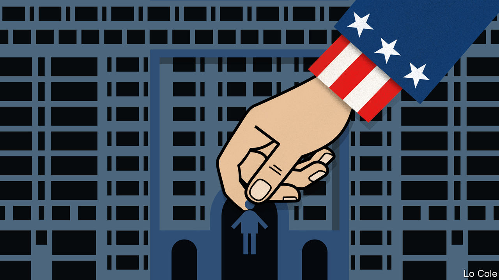

###### Bello

# The return of the Monroe doctrine 

##### A defeat for a weak and divided Latin America 

 

> Sep 17th 2020 

ONLY A DECADE ago Latin America seemed to be making a mark in the world. Enriched by a commodity boom and with democracy contributing to social progress, many of the region’s governments felt part of “the rise of the south” in a multipolar world. John Kerry, Barack Obama’s secretary of state, said in 2013 that the United States saw its newly self-confident neighbours as equals. “The era of the Monroe doctrine is over,” he declared, referring to an early American president’s warning to European monarchies to keep out of the western hemisphere, which gradually evolved into the belief that the United States was the hegemon of the Americas.

Under President Donald Trump, the Monroe doctrine seems to be back. In 2019 John Bolton, then Mr Trump’s national security adviser, proclaimed it to be “alive and well” in a speech in which he pledged to topple the dictatorships of Venezuela and Cuba. The United States has so far failed in that, but its neo-Monrovianism has now produced a victory. It will take over the presidency of the Inter-American Development Bank (IDB), a big regional lender which, though based in Washington, DC, has been in Latin American hands since its founding in 1959. On September 12th a virtual meeting of the board of governors chose Mauricio Claver-Carone, the Trump administration’s top official for Latin America, as the bank’s president.


He is a controversial choice, and not just because his election breaks with precedent. Until 2017 he was a lobbyist against Cuba’s communist regime. A conservative Republican with limited experience of economic development, he is the chief architect of the sanctions the administration has imposed on Venezuela. He insists that he will be both a reforming president, and one who respects the views of the board of governors. Ojalá (if only), as Latin Americans say.

It is reasonable to assume that if Mr Trump wins a second term in November the IDB will become a tool of United States foreign policy. Mr Claver-Carone shares the obsessions of his political sponsor, Senator Marco Rubio of Florida. One is to overthrow Cuban communism as well as the Venezuelan regime. The other is to drive China out of Latin America. Mr Claver-Carone talks of hiring more staff from small countries in Central America and the Caribbean, where China and Venezuela are influential. More lending to those countries may follow.

Many Latin Americans would like to see democracy come to Cuba and Venezuela, and worry about Chinese influence. But it is hardly in the region’s interest to let these concerns overwhelm others or to divert development money away from needs made even more pressing by the pandemic, such as strengthening health care and education in the countries where most Latin Americans live. For these reasons a few governments—and many of the region’s most distinguished former leaders—opposed Mr Claver-Carone. Yet they failed to unite behind a better qualified candidate; 23 of the region’s 28 governments, including Brazil and Colombia, bowed to Mr Trump’s will.

That it can no longer lead one of its flagship international institutions marks a nadir for Latin America. The region is dis-integrating. For that, the hubris of the Latin American left when in power a decade ago is partly to blame. Hugo Chávez in Venezuela and Luiz Inácio Lula da Silva in Brazil forged integration schemes based on political alignment (and more or less explicit anti-Americanism) rather than abiding national interest. Leftist excess contributed to polarisation and the advent of its opposite. Jair Bolsonaro, Brazil’s hard-right president, used Mr Trump’s victory as a template for his own in 2018. His government has slavishly aligned with his idol’s, out of ideological conviction. That seems to be the case, too, with Iván Duque, Colombia’s president, who describes himself as a moderate but on foreign policy is not.

Another factor is weakness. The pandemic has struck the region hard after years of economic stagnation. Many presidents are in no mood to take risks. Mexico’s Andrés Manuel López Obrador, a bully at home but a coward abroad, first backed and then scotched an Argentine plan to prevent a quorum at the governors’ meeting to stop Mr Claver-Carone. Mr López Obrador mistrusts international financial institutions. Other governments reckoned Mr Claver-Carone was best placed to increase the IDB’s capital and thus its loans. Few want a fight with Mr Trump. They prefer to hide in the wings of the world stage.

