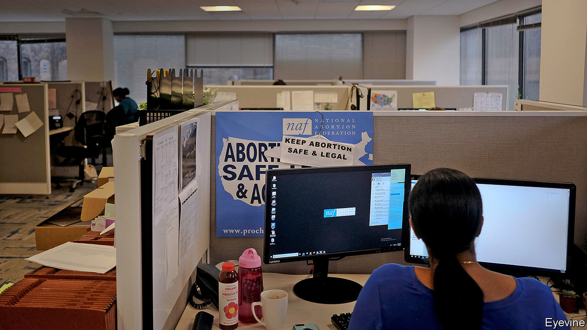

###### No scrubs

# Abortion by pill is becoming more widespread in America 

##### Changes to medical technology will change the politics of the country’s original culture war 

 

> Sep 19th 2020 

WHEN WOMEN used to tell Susan Long (not her real name), a doctor in Washington state, that they wanted to terminate a pregnancy, she would refer them to an abortion clinic. Today, they need not even walk into her office: after an online consultation, she prescribes two pills, which she posts, along with instructions on how to take them several hours apart.

It is difficult to exaggerate the benefit for “innumerable” women of being able to have an abortion at home, without having to arrange a trip to a clinic, she says, describing some of them. The university student living with her conservative parents, hundreds of miles from the nearest abortion clinic. The woman whose violent husband is vehemently pro-life. Single mothers, strapped for cash and child care. Those whose frail health prevents them risking exposure to covid-19 at a doctor’s office.


Dr Long does this work for Aid Access, a non-profit that prescribes and posts abortion pills, mostly from overseas, to women in America. Many live in states that have restricted access to abortion. The FDA has ordered Aid Access to stop doing this, saying it breaks the law. But it is only since July this year that Dr Long has also been able to legally mail the pills to patients in her own general practice, although she lives in a state which has few abortion restrictions. Previously that was impossible.

That is because although the Food and Drug Administration (FDA) has approved the drugs—mifepristone, which blocks the effects of the pregnancy-enabling hormone progesterone; and misoprostol, which induces contractions—to abort pregnancies of less than ten weeks’ gestation since 2000, it has also imposed more stringent regulations than those that apply to most drugs in America. As a result, despite its relatively low cost, abortion by pill is less prevalent in America than it is elsewhere. In most northern European countries, abortion by this method accounts for more than two thirds of all terminations (see Britain section). In America, the figure is around 40%.

Abortion-rights campaigners and the American College of Obstetricians and Gynaecologists have lobbied the FDA to drop its most burdensome requirement: that women collect one of the drugs, mifepristone, from a doctor’s office or clinic. They argue this is both unnecessary—research suggests the drug is safe—and a barrier to the right to abortion established in Roe v Wade. In July, a federal judge ordered the rule to be lifted during the covid-19 epidemic because it posed a “substantial obstacle” to women seeking an abortion. The Trump administration has asked the Supreme Court to intervene.

It is difficult to argue against the judge’s logic for ditching this rule. During the epidemic, women in many places have had to wait longer than usual for an abortion. A delay of a week or two can be distressing; worse, it can mean the difference between a legal abortion and an illegal one. The problem is particularly acute in America because abortion access has already been so curtailed. Anti-abortion regulations have forced hundreds of clinics to close. Six states have only one left.

Yet barriers to abortion by post remain. The biggest is that the court ruling in July has made little difference in the 15 states that require a doctor’s presence when a woman collects abortion medication. In those states, and wherever else women are unable to find doctors prepared to post the drug to them, demand for Aid Access and other such services will continue to rise.

Research into the non-profit, which was established in 2018, highlights the role that abortion pills by mail can play when health services are stretched. Abigail Aiken of the University of Texas at Austin says that within the first few weeks of the pandemic, demand surged. In Texas, after all abortions were cancelled for several weeks, demand nearly doubled. TelAbortion, an FDA-approved programme run by Gynuity Health Projects, which operates in 13 states, has also seen growing demand.

Most of the women Aid Access helps are poor. An increasing number have been unable to afford the $95 it asks (but does not require) for its services. Doctors say they have prescribed for many women who could not afford to travel to a clinic or cover the cost when they got there. Since 1976 the Hyde Amendment has forbidden the use of federal funds for abortion.

For the majority of Americans, who believe that abortions should be legal in the first trimester but not thereafter, the growth of abortion medication is good news. Research suggests that access to medication using telemedicine leads to fewer second-trimester abortions. Just as ultrasound images of fetuses in the womb foster pro-life views in some, this is a technology likely to shift views in the opposite direction. Anti-abortionists will be keen to downplay this as they move their focus from physical clinics to abortion by pill. In February congressional Republicans introduced a bill banning “teleabortion”. This month, 20 Republican senators wrote a letter to the FDA urging it to take mifepristone off the market because it was “dangerous”.

It will be more difficult to campaign against mail-order abortions than it has been against those done in clinics. A woman taking tablets at home inspires less incendiary rhetoric than a doctor in scrubs performing a dilation and evacuation. It is later abortions, when the fetus is recognisably a baby, that provide the gruesome pictures protesters wave outside clinics. They seem unlikely to start waving them outside women’s homes.■

Dig deeper:Read the  and our , then sign up for Checks and Balance, our  and  on American politics.

