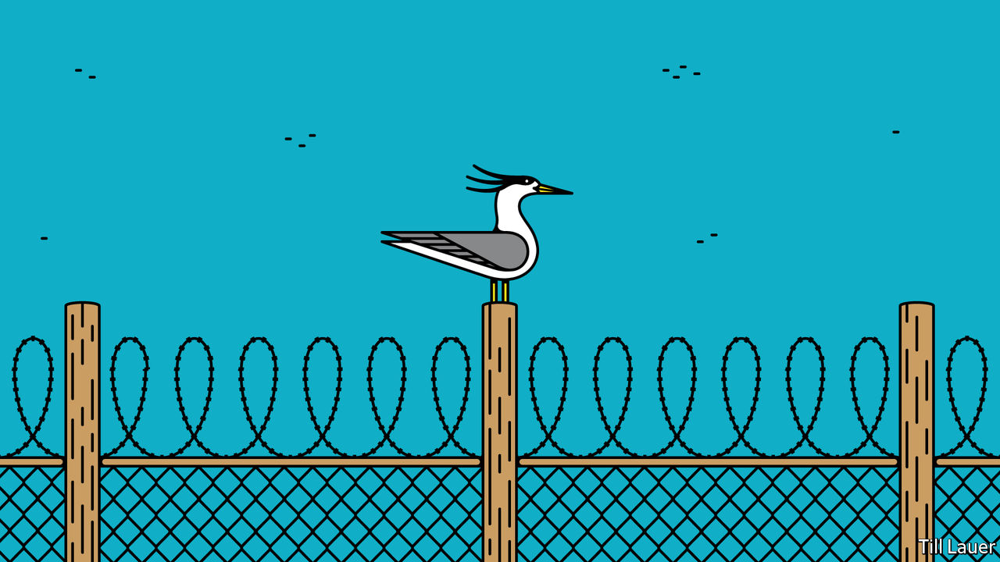

###### Banyan

# Even as countries peck at each other, their birdwatchers co-operate 

##### When all other forms of detente fail, reach for the binoculars 

 

> Sep 26th 2020 

FOR THOSE awed by nature on a planetary scale, this is a special time of year. During the autumn bird migration, 50m-odd individuals from 155 species of waders and other waterbirds barrel down the great avian thoroughfare known as the East Asian-Australasian Flyway.

It stretches from breeding grounds in Alaska and the extreme north-east of Russia all the way to Australia and New Zealand. In Hong Kong, where Banyan resides, wetlands and mudflats at Mai Po are of global importance—a crucial pitstop along the flyway. Fion Cheung of the WWF, which works to protect Mai Po, says it is filling up with early arrivals: Eurasian curlews, with long curved bills, and dumpy broad-billed sandpipers.


Waders reliant on rich tidal mudflats to feed need all the help they can get in this part of the world. Illegal hunters put up mist nets along China’s coast. Worse, in just 70 years China has lost more than half of its coastal wetlands to “reclamation”. In one senseless project in South Korea, 400 square kilometres of tidal estuary have been enclosed at Saemangeum. Among many species affected, the spoon-billed sandpiper now faces extinction. When two “spoonies” turned up at Mai Po this year, says Ms Cheung, birdwatchers outnumbered them many times over.

So Asia’s tiny group of bird experts was appalled earlier this month when the world’s biggest bird-conservation body, BirdLife International, a Britain-based umbrella group of NGOs from around the globe, expelled its longstanding member from Taiwan, the Chinese Wild Bird Federation (CWBF). The CWBF has led the charge to protect the habitat of the black-faced spoonbill, which breeds in the demilitarised zone between North and South Korea, winters in Taiwan and farther south, and had declined to barely 400 individuals. Numbers have climbed back to over 4,800, thanks in large part to the CWBF’s efforts.

Even more striking, the CWBF has helped bring the Chinese crested tern back from the dead. In 1937 an ornithologist shot 21 specimens, stuffing them in a museum drawer in Beijing. Never seen after that, the Chinese crested tern was presumed extinct. But in 2000 Taiwanese ornithologists rediscovered a few birds on disputed islets just off the Chinese coast. From perhaps a dozen individuals, the count is up to about 40 pairs breeding on Taiwanese and Chinese islands—still one of the world’s rarest birds.

BirdLife International denies that China, which claims Taiwan as its own and objects to anything that makes it look like an independent country, encouraged the expulsion of the CWBF. Instead BirdLife claims, implausibly, that to preserve its charitable status in Britain it had to ask for assurances that the CWBF would not take any “political” stances regarding Taiwan’s international status—which the CWBF refused to do. It may be that BirdLife took the step on its own initiative, hoping for better access to China, or perhaps even a boost to its funding. If so, there is no sign of either yet.

Allen Lyu of the CWBF insists that the organisation is apolitical, and has always bent over backwards to accommodate diplomatic niceties (it has already changed its name three times to assuage concerns). Whatever the details, the expulsion takes place in a region made more brittle by Chinese assertiveness. In recent days China has grown angry over a shopping list of American arms that Taiwan wants in order to hold back the kind of invasion China reserves the right to launch against it. In a show of strength, nearly 40 Chinese warplanes have crossed the two countries’ median line in the Taiwan Strait (right on the flyway). Even New Zealand has got it in the neck for, among other things, backing Taiwan’s involvement in the World Health Organisation, to which China vehemently objects.

In these tense times, raise a cheer for those Asians whose passion for conservation helps keep channels open. North Korea’s move to protect two wetlands under an international convention may be the only recent instance of the nuclear state sincerely embracing global institutions. The saga of the Chinese crested tern has strengthened relations between mainland and Taiwanese ornithologists, who hold an annual get-together on the tern’s status organised by the CWBF. Four years ago New Zealand and China signed a treaty to protect the habitat of the bar-tailed godwit, which, Maori tradition holds, carries the spirits of their forebears back and forth from their ancestral homeland. What better emblem could there be for cross-border co-operation?

