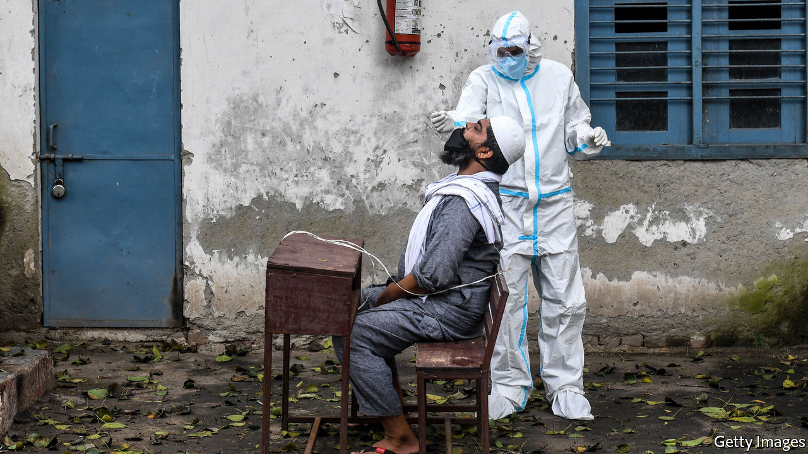
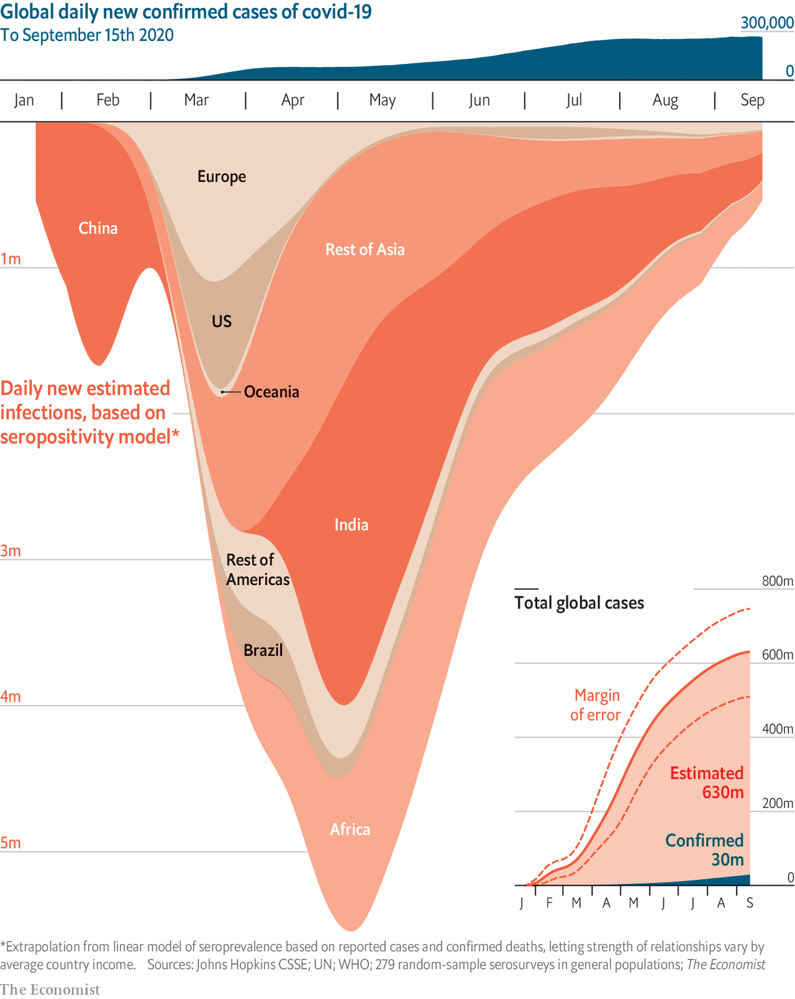
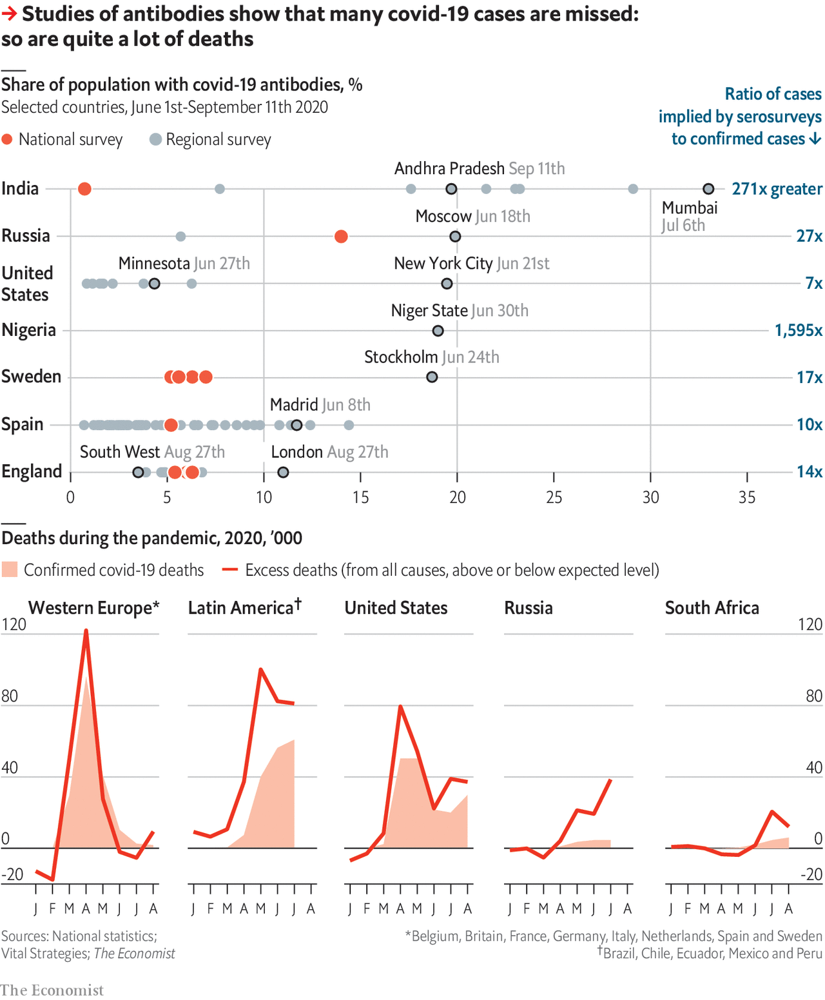
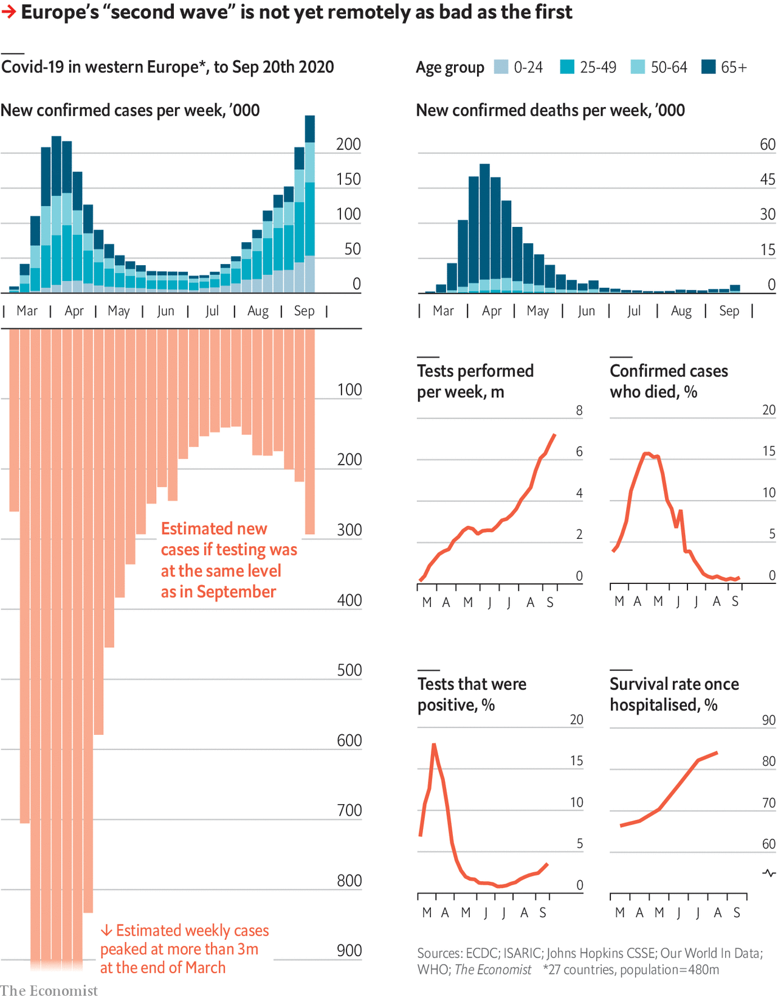
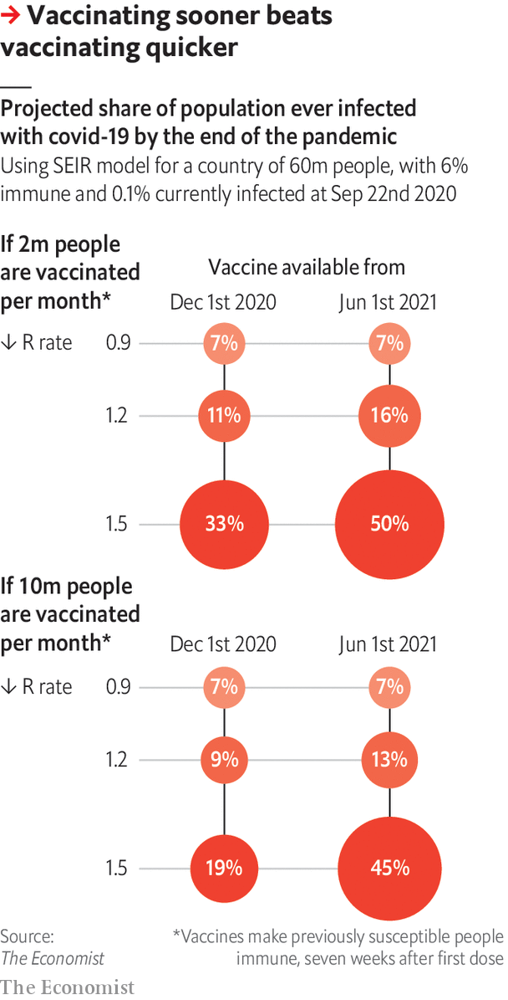

###### One million and counting

# The covid-19 pandemic is worse than official figures show 

##### But some things are improving, and it will not go on for ever 

 

> Sep 26th 2020 

Editor’s note: Some of our covid-19 coverage is free for readers of The Economist Today, our daily . For more stories and our pandemic tracker, see our 

AS THE AUTUMNAL equinox passed, Europe was battening down the hatches for a gruelling winter. Intensive-care wards and hospital beds were filling up in Madrid and Marseille—a city which, a few months ago, thought it had more or less eliminated covid-19. Governments were implementing new restrictions, sometimes, as in England, going back on changes made just a few months ago. The al-fresco life of summer was returning indoors. Talk of a second wave was everywhere.

Across the Atlantic the United States saw its official covid-19 death toll—higher than that of all western Europe put together—break the 200,000 barrier. India, which has seen more than half a million new cases a week for four weeks running, will soon take America’s unenviable laurels as the country with the largest official case count.


The world looks set to see its millionth officially recorded death from covid-19 before the beginning of October. That is more than the World Health Organisation (WHO) recorded as having died from malaria (620,000), suicide (794,000) or HIV/AIDS (954,000) over the whole of 2017, the most recent year for which figures are available.

 


Those deaths represent just over 3% of the recorded covid-19 cases, which now number over 32m. That tally is itself an underestimate of the number who have actually been infected by SARS-CoV-2, the virus which causes covid 19. Many of the infected do not get sick. Many who do are never seen by any health system.

A better, if still imperfect, sense of how many infections have taken place since the outbreak began at the end of last year can be gleaned from “serosurveys” which scientists and public-health officials have undertaken around the world. These look for antibodies against SARS-CoV-2 in blood samples which may have been taken for other purposes. Their presence reveals past exposure to the virus.

Various things make these surveys inaccurate. They can pick up antibodies against other viruses, inflating their totals—an effect which can differ from place to place, as there are more similar-looking viruses circulating in some regions than in others. They can mislead in the other direction, too. Some tests miss low levels of antibody. Some people (often young ones) fight off the virus without ever producing antibodies and will thus not be recorded as having been infected. As a result, estimates based on serosurveys have to be taken with more than a grain of salt.

But in many countries it would take a small sea’s worth of the stuff to bring the serosurvey figures into line with the official number of cases. The fact that serosurvey data are spotty—there is very little, for example, openly available from China—means it is not possible to calculate the global infection rate directly from the data at hand. But by constructing an empirical relationship between death rates, case rates, average income—a reasonable proxy for intensity of testing—and seropositivity it is possible to impute rates for countries where data are not available and thus estimate a global total.

The graphic on this page shows such an estimate based on 279 serosurveys in 19 countries. It suggests that infections were already running at over 1m a day by the end of January—when the world at large was only just beginning to hear of the virus’s existence. In May the worldwide rate appears to have been more than 5m a day. The uncertainties in the estimate are large, and become greater as you draw close to the present, but all told it finds that somewhere between 500m and 730m people worldwide have been infected—from 6.4% to 9.3% of the world’s population. The WHO has not yet released serosurvey-based estimates of its own, though such work is under way; but it has set an upper bound at 10% of the global population.

As the upper part of the following data panel shows, serosurvey results which can be directly compared with the diagnosed totals are often a great deal bigger. In Germany, where cases have been low and testing thorough, the seropositivity rate was 4.5 times the diagnosed rate in August. In Minnesota a survey carried out in July found a multiplier of seven. A survey completed on August 23rd found a 6.02% seropositivity rate in England, implying a multiplier of 12. A national serosurvey of India conducted from the middle of May to early June found that 0.73% were infected, suggesting a national total of 10m. The number of registered cases at that time was 226,713, giving a multiplier of 44. Such results suggest that a global multiplier of 20 or so is quite possible.

If the disease is far more widespread than it appears, is it proportionately less deadly than official statistics, mainly gathered in rich countries, have made it look? Almost certainly. On the basis of British figures David Spiegelhalter, who studies the public understanding of risk at Cambridge University, has calculated that the risk of death from covid increases by about 13% for every year of age, which means a 65-year-old is 100 times more likely to die than a 25-year-old. And 65-year-olds are not evenly distributed around the world. Last year 20.5% of the EU’s population was over 65, as opposed to just 3% of sub-Saharan Africa’s.

But it is also likely that the number of deaths, like the number of cases, is being seriously undercounted, because many people will have died of the disease without having had a positive test for the virus. One way to get around this is by comparing the number of deaths this year with that which would be predicted on the basis of years past. This “excess mortality” method relies on the idea that, though official statistics may often be silent or misleading as to the cause of death, they are rarely wrong about a death actually having taken place.

The excessive force of destiny

The Economist has gathered all-cause mortality data from countries which report them weekly or monthly, a group which includes most of western Europe, some of Latin America, and a few other large countries, including the United States, Russia and South Africa (see lower part of data panel). Between March and August these countries recorded 580,000 covid-19 deaths but 900,000 excess deaths; the true toll of their share of the pandemic appears to have been 55% greater than the official one. This analysis suggests that America’s official figures underestimate the death toll by 30% or more (America’s Centres for Disease Control and Prevention have provided a similar estimate). This means that the real number of deaths to date is probably a lot closer to 300,000 than 200,000. That is about 10% of the 2.8m Americans who die each year—or, put another way, half the number who succumb to cancer. And there is plenty of 2020 still to go.

 


Add to all this excess mortality unreported deaths from countries where record keeping is not good enough to allow such assessments and the true death toll for the pandemic may be as high as 2m.

What can be done to slow its further rise? The response to the virus’s original vertiginous ascent was an avalanche of lockdowns; at its greatest extent, around April 10th, at least 3.5bn people were being ordered to stay at home either by national governments or regional ones. The idea was to stop the spread of the disease before health-care systems collapsed beneath its weight, and in this the lockdowns were largely successful. But in themselves they were never a solution. They severely slowed the spread of the disease while they were in place, but they could not stay in place for ever.

Stopping people interacting with each other at all, as lockdowns and limits on the size of gatherings do, is the first of three ways to lower a disease’s reproduction number, R—the number of new cases caused by each existing case. The second is reducing the likelihood that interactions lead to infection; it requires mandated levels of social distancing, hygiene measures and barriers to transmission such as face masks and visors. The third is reducing the time during which an infectious person can interact with people under any conditions. This is achieved by finding people who may recently have been infected and getting them to isolate themselves.

Ensuring that infectious people do not have time to do much infecting requires a fast and thorough test-and-trace system. Some countries, including Canada, China, Germany, Italy, Japan, Singapore and Taiwan, have successfully combined big testing programmes which provide rapid results with a well developed capacity for contact tracing and effective subsequent action. Others have foundered.

Networks and herds

Israel provides a ready example. An early and well-enforced lockdown had the expected effect of reducing new infections. But the time thus bought for developing a test-and-trace system was not well used, and the country’s emergence from lockdown was ill-thought-through. This was in part because the small circle around prime minister Binyamin Netanyahu into which power has been concentrated includes no one with relevant expertise; the health ministry is weak and politicised.

Things have been made worse by the fact that social distancing and barrier methods are being resisted by some parts of society. Synagogues and Torah seminaries in the ultra-Orthodox community and large tribal weddings in the Arab-Israeli community have been major centres of infection. While unhappy countries, like Tolstoy’s unhappy families, all differ, the elements of Israel’s dysfunction have clear parallels elsewhere.

Getting to grips with “superspreader” events is crucial to keeping R low. Close gatherings in confined spaces allow people to be infected dozens at a time. In March almost 100 were infected at a biotech conference in Boston. Many of them spread the virus on: genetic analysis subsequently concluded that 20,000 cases could be traced to that conference.

Nipping such blooms in the bud requires lots of contact tracing. Taiwan’s system logs 15-20 contacts for each person with a positive test. Contact tracers in England register four to five close contacts per positive test; those in France and Spain get just three. It also requires that people be willing to get tested in the first place. In England only 10-30% of people with covid-like symptoms ask for a test through the National Health Service. One of the reasons is that a positive test means self-isolation. Few want to undergo such restrictions, and few are good at abiding by them. In early May a survey in England found that only a fifth of those with covid symptoms had self-isolated as fully as required. The government is now seeking to penalise such breaches with fines of up to £10,000 ($12,800). That will reduce the incentive to get tested in the first place yet further.

As much of Europe comes to terms with the fact that its initial lockdowns have not put an end to its problems, there is increased interest in the Swedish experience. Unlike most of Europe, Sweden never instigated a lockdown, preferring to rely on social distancing. This resulted in a very high death rate compared with that seen in its Nordic neighbours; 58.1 per 100,000, where the rate in Denmark is 11.1, in Finland 6.19 and in Norway 4.93. It is not clear that this high death rate bought Sweden any immediate economic advantage. Its GDP dropped in the second quarter in much the same way as GDPs did elsewhere.

It is possible that by accepting so many deaths upfront Sweden may see fewer of them in the future, for two reasons. One is the phenomenon known, in a rather macabre piece of jargon, as “harvesting”. Those most likely to succumb do so early on, reducing the number of deaths seen later. The other possibility is that Sweden will benefit from a level of herd immunity: once the number of presumably immune survivors in the population grows high enough, the spread of the disease slows down because encounters between the infected and the susceptible become rare. Avoiding lockdown may conceivably have helped with this.

On the other hand, one of the advantages of lockdowns was that they provided time not just for the development of test-and-trace systems but also for doctors to get better at curing the sick. In places with good health systems, getting covid-19 is less risky today than it was six months ago. ISARIC, which researches infectious diseases, has analysed the outcomes for 68,000 patients hospitalised with covid-19; their survival rate increased from 66% in March to 84% in August. The greatest relative gains have been made among the most elderly patients. Survival rates among British people 60 and over who needed intensive care have risen from 39% to 58%.

This is largely a matter of improved case management. Putting patients on oxygen earlier helps. So does reticence about using mechanical ventilators and a greater awareness of the disease’s effects beyond the lungs, such as its tendency to provoke clotting disorders.

Nouvelle vague

As for treatments, two already widely available steroids, dexamethasone and hydrocortisone, increase survival by reducing inflammation. Avigan, a Japanese flu drug, has been found to hasten recovery. Remdesivir, a drug designed to fight other viruses, and convalescent plasma, which provides patients with antibodies from people who have already recovered from the disease, seem to offer marginal benefits.

Many consider antibodies tailor-made for the job by biotech companies a better bet; over the past few years they have provided a breakthrough in the treatment of Ebola. The American government has paid $450m for supplies of a promising two-antibody treatment being developed by Regeneron. That will be enough for between 70,000 and 300,000 doses, depending on what stage of the disease the patients who receive it have reached. Regeneron is now working with Roche, another drug company, to crank up production worldwide. But antibodies will remain expensive, and the need to administer them intravenously limits their utility.

It is tempting to look to better treatment for the reason why, although diagnosed cases in Europe have been climbing steeply into what is being seen as a second wave, the number of deaths has not followed: indeed it has, as yet, barely moved. The main reason, though, is simpler. During the first wave little testing was being done, and so many infections were being missed. Now lots of testing is being done, and vastly more infections are being picked up. Correct for this distortion and you see that the first wave was far larger than what is being seen today, which makes today’s lower death rate much less surprising (see data panel).

 


The coming winter is nevertheless worrying. Exponential growth can bring change quickly when R gets significantly above one. There is abundant evidence of what Katrine Bach Habersaat of the WHO calls “pandemic fatigue” eating away at earlier behavioural change, as well as increasing resentment of other public-health measures. YouGov, a pollster, has been tracking opinion on such matters in countries around the world. It has seen support for quarantining people who have had contact with someone infected fall a bit in Asia and rather more in the West, where it is down from 78% to 63%. In America it has fallen to 55%.

It is true that infection rates are currently climbing mostly among the young. But the young do not live in bubbles. Recent figures from Bouches-du-Rhône, the French department which includes Marseille, show clearly how a spike of cases in the young becomes, in a few weeks, an increase in cases at all ages.

As the fear of such spikes increases, though, so does the hope that they will not be recurring all that much longer. Pfizer, which has promising vaccine candidate in efficacy trials, has previously said that it will seek regulatory review of preliminary results in October, though new standards at the Food and Drug Administration may not allow it to do so in America quite that soon. Three other candidates, from AstraZeneca, Moderna and J&amp;J, are nipping at Pfizer’s heels. The J&amp;J vaccine is a newcomer; it entered efficacy trials only on September 23rd. But whereas the other vaccines need a booster a month after the first jab, the J&amp;J vaccine is administered just once, which will make the trial quicker; it could have preliminary results in November.

 


None of the companies will have all the trial data they are planning for until the first quarter of next year. But in emergencies regulators can authorise a vaccine’s use based on interim analysis if it meets a minimum standard (in this case, protection of half those who are vaccinated). Authorisation for use under such conditions would still make such a vaccine more credible than those already in use in China and Russia, neither of which was tested for efficacy at all. But there have been fears that American regulators may, in the run up to the presidential election, set the bar too low. Making an only-just-good-enough vaccine available might see social-distancing collapse and infections increase; alternatively, a perfectly decent vaccine approved in a politically toxic way might not be taken up as widely as it should be.

In either case, though, the practical availability of a vaccine will lag behind any sort of approval. In the long run, billions of doses could be needed. A global coalition of countries known as Covax wants to distribute 2bn by the end of 2021—which will only be enough for 1bn people if the vaccine in question, like Pfizer’s or AstraZeneca’s, needs to be administered twice. The world’s largest manufacturer of vaccines, the Serum Institute in India, recently warned that there will not be enough supplies for universal inoculation until 2024 at the earliest.

Even if everything goes swimmingly, it is hard to see distribution extending beyond a small number of front-line health and care workers this year. But the earlier vaccines are pushed out, the better. The data panel on this page looks at the results of vaccinating earlier versus later in a hypothetical population not that unlike Britain’s. Vaccination at a slower rate which starts earlier sees fewer eventual infections than a much more ambitious campaign started later. At the same time increases in R—which might come about if social distancing and similar measures fall away as vaccination becomes real—make all scenarios worse.

By next winter the covid situation in developed countries should be improved. What level of immunity the vaccines will provide, and for how long, remains to be seen. But few expect none of them to work at all.

Access to the safety thus promised will be unequal, both within countries and between them. Some will see loved ones who might have been vaccinated die because they were not. Minimising such losses will require getting more people vaccinated more quickly than has ever been attempted before. It is a prodigious organisational challenge—and one which, judging by this year’s experience, some governments will handle considerably better than others. ■

