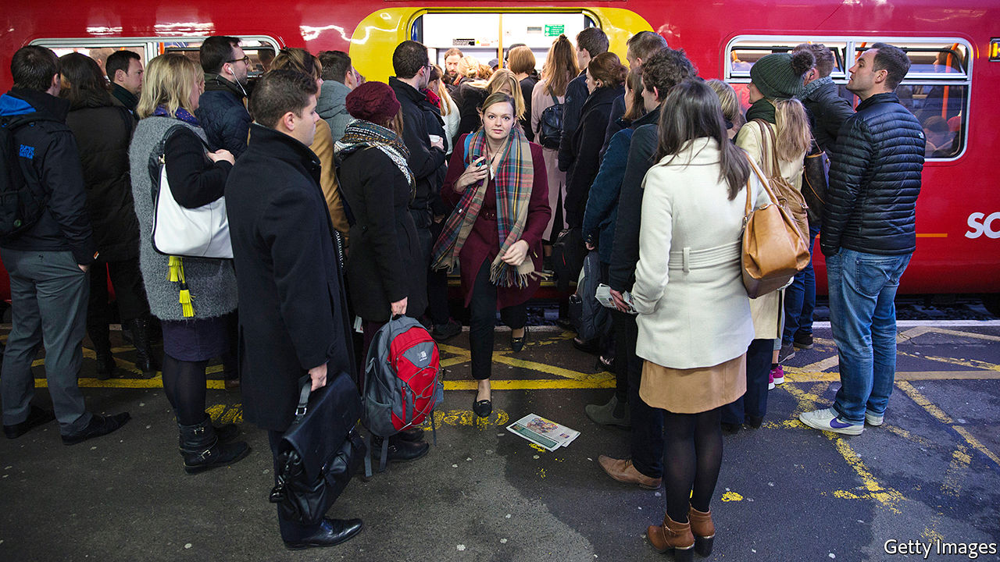
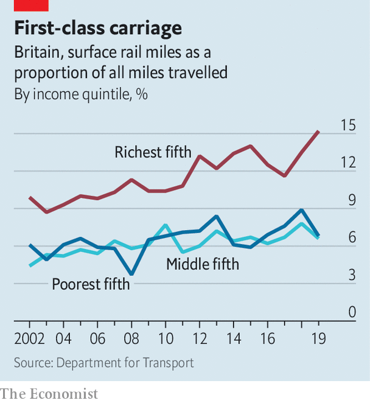

###### Railways

# Britain’s experiment in radical rail privatisation is over 

##### A new franchising system could follow 

 

> Sep 26th 2020 

IN 2013 THE then transport secretary, Patrick McLoughlin, gave a speech to mark the 20th anniversary of railway privatisation. It had been a brilliant success, he said. Britain had turned a clapped-out railway network into the safest, most improved system in Europe. Naturally, there had been “a few wobbles along the way”, but these had been sorted out. Anybody who believed that railways ought to be controlled by the state was “completely missing the point”.

Now look at it. On September 21st the transport secretary, Grant Shapps, declared that the model of railway privatisation that Britain has followed for the past two and a half decades had stopped working, and would end forthwith. He did not even pin all the blame on covid-19, which has cut train travel by about three-fifths. So was railway privatisation a brilliant success that went wrong, or was it flawed from the beginning?


Although many rich countries privatised their railways in the 1980s and 1990s, few were as bold as Britain. Whereas Germany and Sweden allowed the incumbent to keep running trains, British Rail was abolished. Private companies were invited to bid for franchises and take on almost all the financial risk of running services. Because the government continued to set many rail fares, their goal was straightforward. If they lured lots of new customers, they would thrive; if not, they would fail.

For a long time, they did thrive. The annual number of railway journeys jumped from 740m to 1.7bn between 1993-94 and 2019-20. That is exceptionally rapid growth, although Sweden and Switzerland (which resisted privatisation) are not far behind. The train-operating companies hustled hard, offering cheap tickets and advertising their shiny new carriages on television. One academic study suggested that 69% of the growth in passengers up to 2009 could be attributed to privatisation.

In another way, though, the revolution failed. In continental Europe, opening the railways to competition reduced costs—something that also happened when Britain’s buses were deregulated. British railways, by contrast, not only stayed expensive but became more so. Net government support for the railways in 2018-19 amounted to £7.1bn—more than twice as much, in real terms, as the average level in the decade before privatisation.

Some of that is because of HS2, an inordinately expensive new railway line. But not all of it. Labour costs are stubbornly high; over the five years to 2018-19 franchisees’ staff costs rose by 19% while passenger miles grew by 12%. Andrew Smith, a transport economist at the University of Leeds, says that the brevity of franchises (often seven years in the early days, though they have lengthened) mean that train operators strive to avoid industrial disputes. They also tend to compete for experienced drivers rather than training their own.

The privatised railway network lacks a guiding hand—a strategist who can think about how the system should evolve and see through big changes. For years that seemed like an abstract weakness. But in 2018 a big change to timetables was botched, leading to mass cancellations. It was unclear who exactly was responsible. The then transport secretary, Chris Grayling, certainly didn’t think it was him.

 


If passenger numbers had kept surging, the high costs and strategic weakness might have been forgiven. But even before covid-19 struck, that seemed improbable. Rail is overwhelmingly a middle-class mode of transport, and becoming more so (see chart). In 2019 adults in the top earnings quintile travelled 1,400 miles each by train, on average, five times more than adults in the bottom quintile. Professionals like trains because they can work on them. But a person who can work on a train can work from home. Around 2018 train operators noticed that commuters were buying fewer season tickets. If you only travel to the office three or four days a week, they aren’t worth it. And even before the pandemic struck, the number of people working from home had started to rise.

For the moment, the state is bailing out the train operators. When the covid crisis ends, Britain will probably move to a new franchising system, in which private companies bid to operate lines but take less financial risk. Rather than try to lure more customers, they will try to hit government targets for punctuality and the like. To the unions’ disappointment, this is not renationalisation; it is closer to the mild continental form of privatisation. The railways’ revolutionary phase is over. ■

