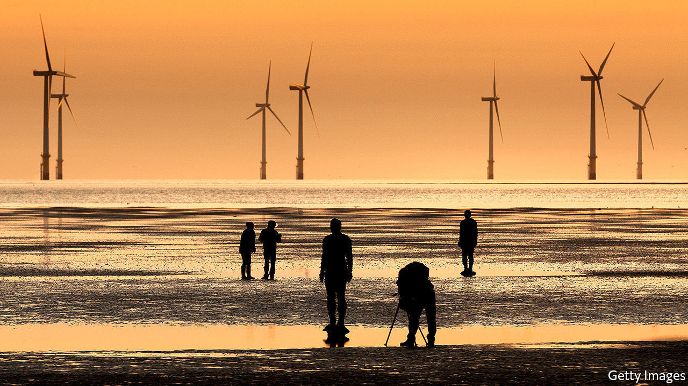
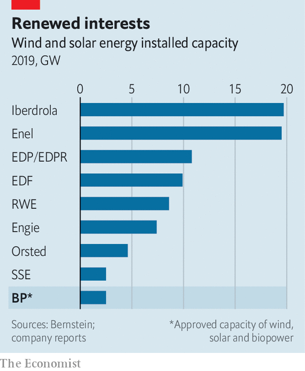

###### The new majors

# BP and other oil majors v utilities 

##### Electric utilities are becoming power players in the energy industry 

 

> Sep 26th 2020 

INVESTOR WEBINARS are not generally mass entertainment. But some 25,000 people tuned in this month when BP outlined plans to transform its business. Top on the British oil-and-gas giant’s to-do list is raising its wind, solar and biopower capacity from 2.5 gigawatts (GW) last year to 20GW by 2025 and 50GW by 2030, when annual investment in low-carbon energy will reach $5bn or so. BP hopes to become a new kind of energy major. It is not alone.

European electric utilities have lately emerged as the world’s top developers of wind and solar projects outside China (see chart). These offer growth and, in an era of ultra-low interest rates, stable returns thanks to long-term contracts. Concern about climate change means that big, risky drilling projects must offer higher returns to lure investors. Michele Della Vigna of Goldman Sachs, a bank, estimates that the divergent cost of capital for oil and renewables investments implies a price of up to $80 a tonne of carbon dioxide, well above the global average of around $3. As share prices of oil giants such as ExxonMobil have tanked amid the pandemic slump in demand for crude, those of electricity majors, such as Spain’s Iberdrola, Germany’s RWE or Portugal’s EDP, are up this year. That of Orsted, a Danish wind-energy champion, has risen by a third. BP wants in. 


A decade ago excess capacity, the financial meltdown and competition from renewables firms imperilled Europe’s traditional power companies. Faced with the falling value of their coal and gas assets, many took the shift to cleaner energy seriously, says Deepa Venkateswaran of Bernstein, a research firm. Orsted has turned itself from an ailing state enterprise into the world’s largest developer of offshore wind. This year RWE and E.ON, another German firm, swapped assets, with E.ON concentrating on grids and RWE on generating clean power. Iberdrola, EDP and Italy’s Enel have invested in wind and solar projects in Europe and beyond. 

 


Now the falling cost of renewables is coinciding with rising ambition to deploy them. Dev Sanyal, who leads BP’s renewables business, sees “very vibrant demand” from America, where states and companies are keener on green than the carbon-cuddling federal government. In Europe, which wants carbon-neutral electricity by 2040, national energy plans require total investment of €825bn ($960bn) over the next decade, Goldman Sachs reckons. 

Mr Sanyal says that BP’s trading capabilities and project management will give it an edge in such projects, which offer a rate of return of 8-10% on equity capital invested. But BP’s planned wind and solar capacity in 2025 would be less than half what Enel or Iberdrola will have by then, estimates Bernstein. Henrik Poulsen, Orsted’s outgoing boss, argues that building an offshore wind turbine is not the same as building an oil platform. “We have much more experience and we have stronger procurement,” he contends.

Those with green ambitions can take comfort. Plentiful future demand for renewables ought to leave room for everyone. George Papadimitriou, who runs Enel’s green business in North America, welcomes new, well-capitalised rivals. Having oil and gas companies join in, he says, “confirms that we’re on the right path”. ■

For more coverage of climate change, register for The Climate Issue, our fortnightly , or visit our 

