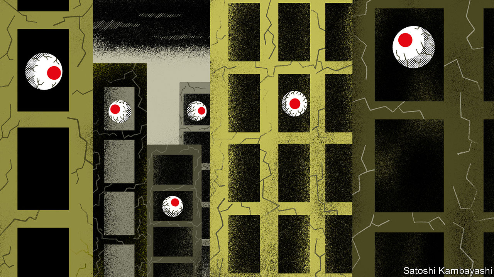

###### The return of the living dead?

# Will Japan see a new generation of zombie firms? 

##### Lessons from the birthplace of the corporate zombie 

 

> Sep 24th 2020 

ECONOMISTS USING the term “zombie” used to have Japanese companies in mind. Firms that are dead competitively but continue to haunt their living peers proliferated in the decade or so following Japan’s financial crisis of 1990, as banks tided unprofitable borrowers over, at times with the government’s encouragement. By 2001 zombies made up more than 15% of listed firms, according to calculations in 2012 by Nakamura Jun-ichi, then of Hitotsubashi University, and Fukuda Shin-ichi of the University of Tokyo. It took drastic reforms of accounting rules and bank-supervision policies in the early 2000s to begin clearing out and reviving the corporate undead.

Zombification has long since spread beyond Japan, and covid-19 has led to fears that the ranks of the undead are swelling further (see ). As in other rich countries, Japan has offered companies generous support during the covid-19 pandemic. The Bank of Japan (BoJ) has announced a slew of monetary-stimulus measures, including making ¥110trn ($1trn, or 20.5% of GDP in 2019) available to support corporate financing. The government has provided credit guarantees, and banks are lending more than they did last year.


The moves were a wise response to the crisis, helping to prevent a surge in bankruptcies and huge rises in unemployment. But some are starting to worry that continued largesse could lead to a new generation of zombie firms. “The foundation of the Japanese economy will be shaken, even if zombie companies are helped,” Nakanishi Hiroaki, head of Japan’s powerful business federation, Keidanren, warned this month. Kuroda Haruhiko, the BoJ’s governor, has played down such worries, promising to taper support as demand picks up.

Japan knows the disastrous consequences of failing to clear out zombies all too well. A landmark paper on Japanese zombie firms by Ricardo Caballero of the Massachusetts Institute of Technology, Hoshi Takeo of the University of California, San Diego, and Anil Kashyap of the University of Chicago in 2008 showed that the presence of zombies in the 1990s depressed profits, productivity and investment. Investment was between 4% and 36% lower in the 1990s than if the share of zombie firms had remained at historical averages. Job turnover in industries with more zombie firms was lower than in others.

As elsewhere, avoiding mass zombification will mean figuring out when the corporate lifeline starts to become counterproductive. Letting zombies go also means lost jobs and more pessimistic consumers—creating deflationary pressures that Japan can ill afford.

Mr Hoshi, now of the University of Tokyo and a pioneer of research into zombie firms, suggests adopting measures that protect workers without shielding inefficient companies. That could range from making it easier for employees to move between firms and industries, to introducing limited universal basic income, a negative income tax or expanded unemployment insurance. In short, policy should help the living, not the living dead. ■

