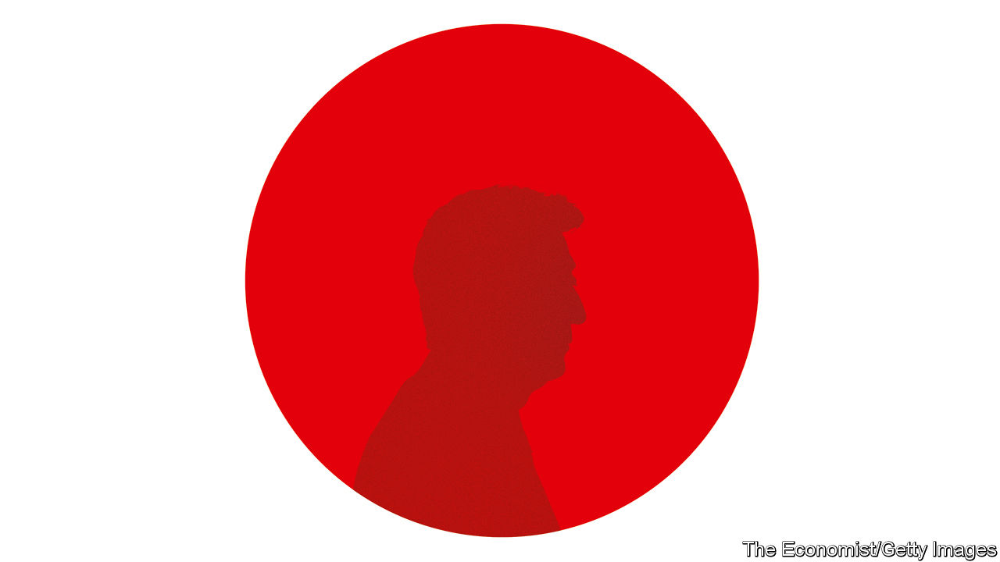
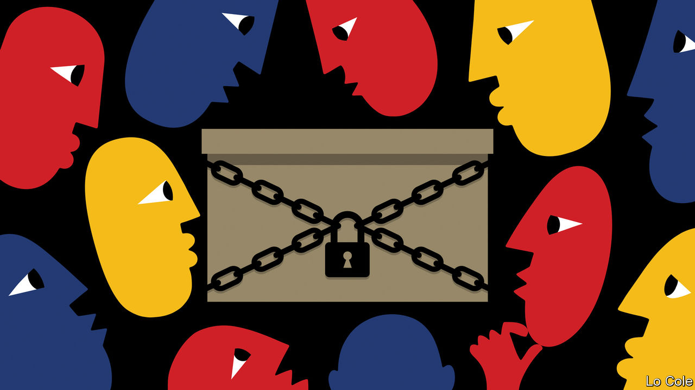

###### On Abe Shinzo, Venezuela, national ID cards, America, Imran Khan’s pets

# Letters to the editor 

##### A selection of correspondence 

> Sep 26th 2020 


 


The aftermath of Abenomics

Alas, how different you are in evaluating the legacy of Abe Shinzo from the people of Japan (“”, September 5th). You praised Mr Abe as a great neoliberal reformer during his time as prime minister, who opened Japan’s market, enhanced productivity and concluded free-trade agreements. Consequently, however, Japan has many more unstable part-time jobs, with lots of women forced to work.


True, some people and companies praise him because they benefited from the increases in productivity and the stockmarket. But the vast majority of Japanese people see things differently, because their standard of living has either not changed or deteriorated. Don’t you see the same soil that invited Brexit?

Worse, you applauded Mr Abe for making Japan “more governable”. Indeed. He shifted political power to the prime minister’s office, making decision-making faster. As a result, today a handful of officials decide policies without discussions among bureaucrats, let alone with the voters.

Inequality in society and such a policymaking process were exactly what Japan had before starting the Pacific war. We need to remember that.

FUMIKO SASAKIAdjunct assistant professor of international affairsColumbia UniversityNew York

 


Capriles capitulates

Bello’s column on Venezuela’s divided opposition was uncharacteristically unbalanced (). Henrique Capriles was described as a moderate, but Juan Guaidó was presented as a radical, linked implicitly to the push from radicals for military intervention by the United States to end Venezuela’s crisis.

Bello is right that the continuation of the outgoing assembly, and therefore the interim government, has no constitutional basis. Yet neither does a dictatorship. Mr Capriles’s strategy of participating in the legislative election, which breaks with the bulk of the opposition (moderates and radicals alike), not only contradicts the notion that you can’t hold a free election when a despot controls the electoral authority and the courts, it also threatens to erode the international backing for Mr Guaidó’s interim government. After many stolen elections (including Mr Capriles’s presidential bid in 2013) and the neutering of the opposition-controlled legislature, Mr Capriles has yet to explain how he intends to counter election fraud or make the opposition effective. The only workable option continues to be to increase internal and international pressure, in the form of sanctions, to force a democratic transition.

HUMBERTO ROMEROPompano Beach, Florida

 


No need for national ID cards

Your article on covid-19 spurring the digitisation of government asserted that a single digital identity for each person should underpin public services, such as track and trace (“”, September 5th). This is not needed. The British government, for instance, has digitised dozens of its services without introducing national identity cards.

The parts of government that provided a competent online response to the pandemic (universal credit, taxes, the health system’s sick-note service) invested in strong internal teams supported by contractors. Over the past six months 3,184 public services have used the government’s Notify platform to send nearly 1bn letters, texts and emails accurately to 80% of the population. This contrasts with buying magical-thinking from consultancies and outsourcing the state’s responsibilities, as it has for track and trace.

It is true that different government records are “isolated” in different departments. Data are isolated because of departmental sovereignty: 1,882 central-government websites existed in Britain before they were consolidated in the GOV.UK site.

The challenge is not one of ID cards. It is one of government. Centralised national identity schemes can be dangerous points of weakness for fraud and hacking, as shown recently in South Korea and Estonia. More urgent is the reform of the Victorian structure of government and its antiquated working practices. Calls for identity schemes often arise to avoid doing this hard work of resetting government for the digital age.

MIKE BRACKENPartnerPublic DigitalLondon

 


America’s voting laws

“” (September 5th) implied that laws barring foreigners from voting in America are based on the constitution. That document grants states the power to set the “manner” of elections to Congress and allows states to appoint members to the Electoral College in any way they choose. Beyond that, it is silent on the process of running elections.

This is not just an academic exercise. Several states have at one point or another granted suffrage to foreigners. The Illegal Immigration Reform and Immigrant Responsibility Act of 1996 does ban non-citizens from voting, but that is an act of Congress, not a feature of the constitution.

BLAKE HAYESPeachtree City, Georgia

Your list of the potential for trouble on America’s election night omitted remarks made by Hillary Clinton on August 25th: “Joe Biden should not concede under any circumstances because I think this is going to drag out, and eventually, I do believe he will win if we don’t give an inch and if we are as focused and relentless as the other side is.”

PAUL MITCHELLWeilerbach, Germany

In 2016 rioting broke out in Oakland following the election of Donald Trump. I don’t recall any such unlawful behaviour from Republicans after losing a national vote.

PAUL SHANNONDoncaster, South Yorkshire

Let’s be clear: Joe Biden is the conservative candidate in this election. He values established institutions and alliances. He recognises the need for change, but calls for a moderated, considered approach rather than radical upheaval. He has a strong sense of personal morality and ethics, and holds to a tradition of dignity and respect in political discourse. He values the rule of law. The incumbent, and the Republican Party in general, value none of these things.

ED KENSCHAFTAnnandale, Virginia

 


Hounded in office

The dogmatic debate in Islam over canines (“”, August 29th) even extends to Imran Khan’s love for pooches, especially “handsome” ones. Mr Khan has owned at least five dogs, earning them an entry in Wikipedia. The Pakistani prime minister has been criticised for his puppy love, such as when a prominent member of the Muslim League objected to one dog, Sheru, being allowed into the house, as this went against cultural and religious values. The matter came to a head when a newspaper accused Motu, another of Mr Khan’s pets, of causing a spat with his wife by interrupting her religious activities. Luckily, Motu was cleared of any wrongdoing, and was seen months later at a meeting between Mr Khan and Iran’s ambassador, indoors, of course.

NOLAN QUINNParkton, Maryland

