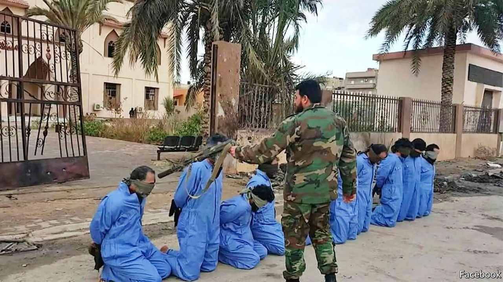

###### Accidental cover-up

# Social-media platforms are destroying evidence of war crimes 

##### Algorithms designed to scrub terrorist propaganda are making it harder to convict terrorists 

 

> Sep 26th 2020 

“PUT YOUR hands up! Put your hands up!” shouts a gunman at his hooded captive, who already has two hands in the air and shuffles about, seemingly unsure what more to do. The gunman then shoots his victim to the ground before firing more bullets into the body and saying: “You have been misled by Satan.”

Until fairly recently, brutal acts such as this might never have come to light. But a video showing this murder was posted on Facebook in 2016. A year later the International Criminal Court (ICC) issued its first-ever warrant that relied, in large part, on videos posted on social media by the perpetrators of war crimes themselves. It called for the arrest of Mahmoud al-Werfalli, a Libyan warlord (pictured). It accused him of being the gunman in the killing described above and of being responsible for murdering 33 people in seven incidents captured in videos on Facebook.


Although Mr Werfalli has yet to appear before the ICC in The Hague, the warrant for his arrest marked a turning-point. For the first time videos and photos posted on social media would not only be used to bring the world’s attention to war crimes, but could also offer hope of bringing the perpetrators to justice. “This is a mine of potential evidence,” wrote Emma Irving, a human-rights expert at Leiden University, in a blog post at the time. Yet for all its promise, the use of social-media evidence also raises real problems.

For a start, evidence posted on social media is far from perfect. People recording atrocities often lack expertise or may be partisan and thus film selectively. Prosecutors and judges may worry that footage has been staged, manipulated or misattributed. These worries will further increase, as it becomes easier to get computers with artificial intelligence to make “deep fakes” or highly plausible audio and video forgeries.

Yet because it is difficult and dangerous to gather evidence in war zones, such footage may be all that prosecutors have to go on. At the very least it can provide new leads, or help to corroborate eyewitness reports and other evidence.

Fighters bragging about their exploits on Facebook may inadvertently give away their location. They may also provide prosecutors with evidence of intent. Such information can help war-crimes prosecutors assemble the gold standard of evidence: a combination of the physical, documentary and testimonial varieties.

In 2018 the BBC looked into a video circulating on social media showing soldiers blindfolding and then shooting two women and children in Cameroon. Although Cameroon’s government initially claimed the video was faked or from elsewhere, the BBC and freelance investigators matched mountains in the background of the footage to maps and satellite images. By analysing shadows on the ground they were able to work out that the killings happened in 2015. To identify the soldiers involved they matched the weapons in the video to those used by specific units in the Cameroonian army. Shamed into action, the government investigated and prosecuted seven soldiers. This week four of them were sentenced to ten years in jail.

Justice deleted

Yet even as prosecutors and the courts are discovering the uses of such evidence, much of it is disappearing. Human Rights Watch, a pressure group, recently revisited the social-media evidence it had cited in its public reports between 2007 and 2020 (though most were published in the past five years). It found that 11% of it had vanished. Others have run into similar problems. The Syrian Archive, a non-profit group that records and analyses evidence of atrocities in Syria, estimates that 21% of the nearly 1.75m YouTube videos it had catalogued up to June 2020 are no longer available. Almost 12% of the 1m or so tweets it logged have also disappeared.

Some of this content will have been deleted by users themselves, but much has been removed by internet companies such as Facebook and Twitter. Sometimes they scrub horrific content for good reasons. They want to protect users from snuff videos and extremist propaganda. Under pressure from activists and governments, many have adopted stringent content-moderation policies. But because there is little, if any, regulation over what happens to content that is removed by social-media firms, there is no certainty that it will be preserved if it is later needed as evidence.

Algorithmic moderation makes the problem worse. In 2017 a new YouTube algorithm proved unable to differentiate between material posted by Islamic State glorifying its killings and that from human-rights activists who were documenting them. YouTube removed hundreds of thousands of videos of abuses in Syria. Many of these were restored after a public outcry, but newer algorithms now take down content before it ever reaches the public. Of the content that Facebook removed for violating its guidelines between January and March, 93% was flagged by automatic systems, not by human moderators. Of those items, half were removed before any viewer saw them.

Human-rights groups argue that internet platforms should be obliged to preserve deleted content, or pass it on to independent archives. In Syria, for instance, had the Syrian Archive not collected copies of videos and tweets showing abuses, much of this evidence would have been lost, and with it any hope of justice for many of those who risked their lives to bear witness, by pressing “record”. ■

