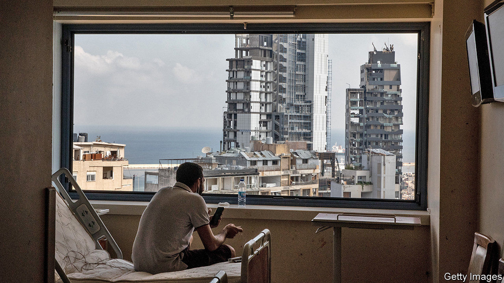

###### After the blast, the bulldozers

# Will the architectural heritage of Beirut survive the explosion? 

##### Residents fear history is repeating itself 

 

> Sep 26th 2020 

THE RUBBLE had not even been cleared when the speculators started to descend. They visited the Ghoulam family twice, offering to buy a shattered home on one of Beirut’s most famous streets. They called one man for days before he finally stopped answering. When the direct approach failed, some tried subterfuge: unnamed visitors whispered to owners that their homes were structurally unsound and should be demolished.

Two months have passed since the massive explosion at Beirut’s port on August 4th, which killed almost 200 people. Much of the city centre is still a wreck, with buildings blown open to the elements and debris heaped on balconies. The army has surveyed more than 85,000 homes and businesses ruined by the blast. The damage to housing alone could cost $2.8bn-$3.4bn, estimates the World Bank.


As the city rebuilds, many Lebanese worry about what will emerge from the rubble. Decades of runaway development have spoiled Beirut’s natural and architectural beauty. The Mediterranean coast was gobbled up by developers, leaving residents without access to public beaches. Stately old homes were bulldozed to make room for unsightly apartment blocks.

Still, the city’s old charm endured in a few neighbourhoods. In Gemmayzeh and Mar Mikhael, Ottoman-era homes with their iconic triple-arched façades were renovated into hipster bars and art galleries. In Karantina, a neglected district by the port, some became shops and churches. Then came the explosion. It damaged 640 historic buildings, says UNESCO, the cultural arm of the United Nations. As developers circle, many Beirutis fear those buildings will be lost for good.

Such fears are rooted in a similar experience decades earlier. Downtown Beirut was heavily damaged during the country’s long civil war, when it became a front line. After the war the prime minister, Rafik Hariri, set up a company called Solidere to oversee reconstruction (his family was one of its largest shareholders). The government used eminent domain (compulsory purchase) to control the city centre. Developers razed hundreds of historic buildings. In their place rose luxury apartments and high-end boutiques priced beyond the reach of most Lebanese. Many sat empty.

Most residents affected by the latest blast hope to stay and rebuild, but some are struggling even to replace their windows. The army recorded 550,000 square metres of broken glass across the city. Last year a square metre cost around $15 or its equivalent in Lebanese pounds, long pegged at 1,500 to the dollar. But a banking crisis that began in October has pushed the pound’s black-market value 80% below the official rate. Annual inflation hit 120% in August. (The central bank is subsidising the import of some construction materials at an intermediate rate.)

With demand high, supplies scarce and the exchange rate a matter of interpretation, vendors charge whatever they wish. Even the scrupulous ones have doubled or tripled their prices. Wood or aluminium frames add to the costs. The state told contractors not to charge more than 750,000 pounds per square metre for glass and aluminium frames—but that is still more than the monthly minimum wage. A new front door costs about two months’ pay.

So the speculators keep hovering, some offering hundreds of thousands of dollars for ruined homes. Property has seemed a relatively safe haven amidst the banking crisis; prices have soared. In the first five months of 2020 the value of real-estate transactions was up 53% compared with the previous year, estimates Bank Audi. A single historic building could be replaced by a tower of pricey flats. Many residents insist their homes are not for sale. But as the economy crashes and the cold, rainy winter sets in, their resolve may falter. ■

