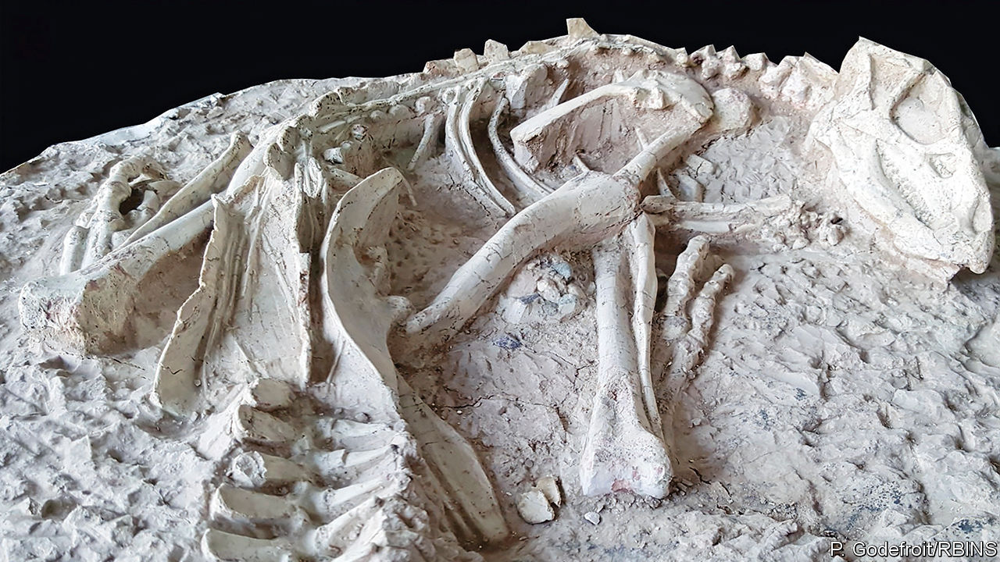

###### Palaeontology

# A burrowing dinosaur 

##### Chinese researchers have found a fossorial fossil 

 

> Sep 26th 2020 

THIS DINOSAUR, a newly described species called Changmiania liaoningensis, was extracted from 123m-year-old rocks in Liaoning province, China. It has a snout shaped like a shovel and a short, robust neck and forearms, and was almost certainly a burrowing animal, like a modern rabbit—though, at 1.2 metres in length, it was somewhat larger. The rocks in question came from a volcanic eruption that entombed local animals by the million. This specimen was reported this week in PeerJ, by Yang Yuqing of Northeastern University, in Shenyang, and his colleagues, together with a second, similarly well preserved. Since the original finds were made by farmers, and their precise locations are unknown, it is impossible to tell whether the animals were buried in their burrows. But their excellent state of preservation makes that likely.

